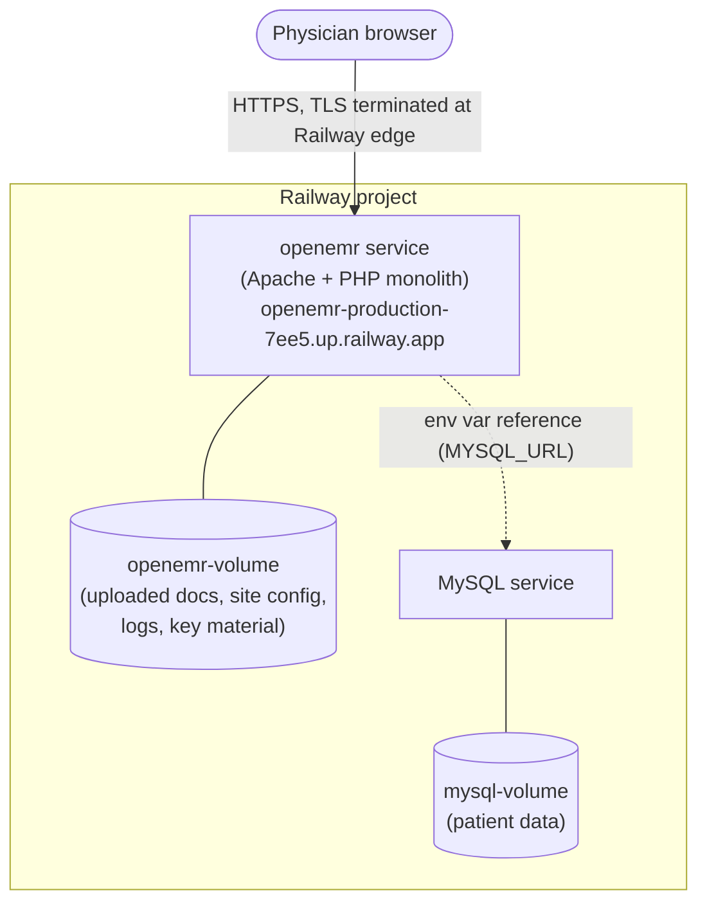
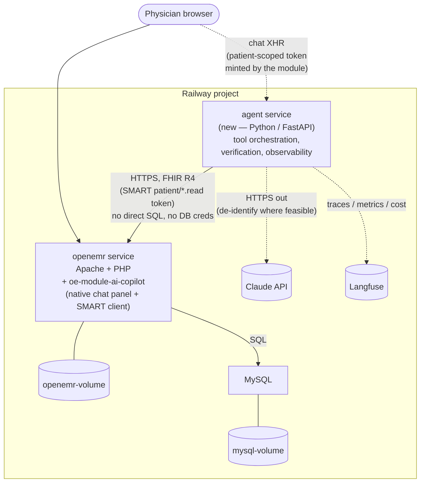
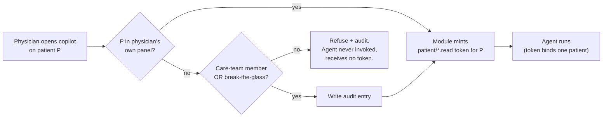
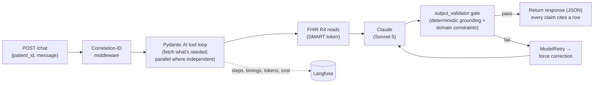

# AI Integration Architecture — AgentForge Clinical Co-Pilot

**Deliverable:** PRD Stage 5 (the AI Integration Plan). This document is the source of
truth every agent capability traces to; each capability below references a use case in
[`USERS.md`](USERS.md) by ID, and every design decision answers a finding in
[`AUDIT.md`](AUDIT.md). Detailed decision evidence (the roads not taken) lives in
`/context/` — see [Decision evidence](#decision-evidence) at the end.

---

## 1. One-page summary

**What we are building.** A conversational Clinical Co-Pilot embedded in OpenEMR that lets
a primary-care physician orient on a patient in the seconds before entering the room —
"who is this, what's open, what changed" — and ask open-ended follow-ups the chart can't
pre-render into a dashboard ([`USERS.md`](USERS.md), UC-1–UC-5). The hard requirement is
not that it answers, but that every answer is **traceable to the patient's actual record**
and that it **refuses** rather than guesses.

**Where the agent lives (Option D).** Two cooperating pieces in one Railway project. A thin
**PHP module** (`oe-module-ai-copilot`) mounts a native chat panel inside the patient chart
via OpenEMR's verified `PatientDemographics\RenderEvent` extension point, reusing OpenEMR's
own session and login — no separate auth, no iframe. All agent logic lives in a
**standalone Python service** (`/agent/`, its own Railway service): orchestration, the
verification gate, correlation IDs, `/health`+`/ready`, and observability. This composes
the best of the alternatives we rejected: native in-EHR UX (Option A), an isolated service
that fits the PRD's engineering requirements (Option B), and single-point authorization
(Option C) — without any of their individual costs.

**How it reads data.** FHIR R4 only, under a SMART `patient/*.read` token the module mints
for the open patient. The agent holds **no database credentials**. It reads six resources
OpenEMR already ships — `Patient`, `Condition`, `MedicationRequest`, `AllergyIntolerance`,
`Encounter`, and `DocumentReference` (the free-text clinical note for a visit) — all as
stock FHIR reads; no custom endpoint was needed.

**Key decisions.** Single agent, not multi-agent — every use case is one conversational
agent over the six-tool set (derivation in [§6](#6-the-agent)). **Pydantic AI** for the
framework, because the PRD's "every response passes through a verification layer" maps
directly onto its `output_validator` + `ModelRetry` hook — the verification requirement
*is* a first-class language feature, not bolted on. **Claude** — the deployed service runs
**Sonnet 5**, a single tier per deploy; the Haiku 4.5 and Opus 4.8 tiers are declared in
config (with pricing) so cost-tiered routing is a config-ready later increment, not a
current per-call behavior. **Langfuse** for traces, token/cost, dashboards, and eval scores.

**How the audit shaped it.** The audit's #1 finding — no patient-level authorization
(IDOR) — is answered by construction: a patient-scoped token makes cross-patient reads
*physically unreachable* through the agent (UC-1–UC-4), and cross-cover (UC-5) is gated in
PHP at the module's launch point (care-team / break-the-glass), never delegated to the LLM.
The new PHI→LLM outbound flow the audit flagged passes through **one** Python code path —
the single de-identification and logging seam.

**Major tradeoffs.** Two languages and two deploy targets (mitigated: same repo, same
Railway project/region, internal networking). FHIR-only accepts second-order med-coding
quirks — handled in the med tool, not by reaching into SQL. And the verification gate
guarantees every claim is **traceable** to the record in one click — *not* that it is
clinically true; it deterministically eliminates ungrounded fabrication but only
probabilistically reduces misattribution, so the physician stays the expert-in-the-loop.
That honesty is the product.

---

## 2. Context & constraints

Three constraints, each pulled from a deliverable, shape every decision downstream.

- **Latency ([`USERS.md`](USERS.md)).** The physician "will not tolerate latency that
  outlasts the walk between two rooms." Target: useful orientation in **<15 seconds**; hard
  ceiling ~90 seconds. No design may introduce an unbounded network-hop chain between the
  user and the first useful token.
- **Security / compliance ([`AUDIT.md`](AUDIT.md)).** Four findings bind the design:
  **(1) IDOR** — authorization is role-scoped, not patient-scoped; the legacy UI accepts
  `pid` from the request with no ownership check. **(2) New PHI→LLM flow** — routing PHI to
  an external model is a new outbound data flow requiring a BAA and a §164.514
  de-identification assessment. **(3) Secrets hygiene** — no committed credentials; all
  secrets via Railway env vars. **(4) No in-app TLS/HSTS** — transport security is the
  operator's job (Railway terminates TLS at its edge), so no new service may assume the app
  enforces it.
- **Posture (PRD).** Demo/synthetic data only; we "act as if a signed BAA exists with all
  LLM providers." We extend that to *all* external vendors (LLM **and** observability), so
  vendor PHI handling is acceptable and BAA availability is not a differentiator — picks are
  made on merit.

A note the audit makes in our favor: OpenEMR's **FHIR/OAuth2 path is materially more mature
than its legacy UI path**. The IDOR gap lives in legacy `pid` resolution; the REST/FHIR
stack uses `league/oauth2-server` with fail-closed default-deny, token-embedded SMART scope
enforcement, and anti-escalation (`ScopeRepository::finalizeScopes` grants only registered
scopes). Reading via a SMART-scoped token means our data path rides the *strong* half of the
system, not the weak one.

---

## 3. System topology — Option D

### 3.1 Baseline (the OpenEMR fork, before the Co-Pilot)

### 3.2 Current state — Option D (deployed today)

**Why the two-concern split.** UI and authentication are things OpenEMR already does well
and we should reuse; LLM orchestration is something PHP does poorly and a clinical app
should not host in-process (a hung LLM call must not degrade unrelated chart loads). So
UI+auth live in a thin PHP module built entirely on **verified extension points — zero core
patches** (`PatientDemographics\RenderEvent` for the panel, the module `Bootstrap` for the
SMART client), and all agent logic lives in an isolated Python process with its own deploy
and scale lifecycle. The two ship from the **same git repo** (`/agent/` directory) into the
**same Railway project/region**, so the added network hop is internal, not public-internet.

---

## 4. Data-access model

**FHIR R4 only, patient-scoped, no DB credentials.** The agent reads exclusively through
OpenEMR's existing FHIR R4 endpoints under a SMART `patient/*.read` bearer token. It never
opens a MySQL connection. Parsing happens at the boundary (`fhir.resources` gives Pydantic
models for each FHIR resource — parse-don't-validate), so downstream code works with typed
objects that guarantee their own validity.

| Tool | FHIR resource | Returns (typed) | Serves |
|---|---|---|---|
| `get_patient()` | `Patient` | `PatientDemographics` | UC-1, UC-5 |
| `get_problems()` | `Condition` | `list[Problem]` (SNOMED, status, onset/abatement) | UC-1, UC-2, UC-4 |
| `get_medications()` | `MedicationRequest` | `list[Medication]` (dedup + text-fallback inside) | UC-1–UC-4 |
| `get_allergies()` | `AllergyIntolerance` | `list[Allergy]` | UC-1, UC-4 |
| `get_encounters()` | `Encounter` | `list[Encounter]` (ordered, date-bounded, "last N") | UC-1, UC-2, UC-3 |
| `get_encounter_note(id)` | `DocumentReference` | free-text clinical note (base64-decoded) | UC-3 |

**The medication data-quality reality (verified against code + live seed DB).** The audit
flags that meds are stored under two schemes and locations. We verified that FHIR
`MedicationRequest` is a SQL `UNION` of *both* med sources — `prescriptions` **and**
`lists WHERE type='medication'` — so **FHIR-only hides no medications**; free-text/list
meds surface as `medicationCodeableConcept.text` even without an RxNorm code. Two
second-order issues are owned by the med tool, not pushed onto the agent's reasoning:

- **Dedup, not omission.** A med in both tables without the internal link appears as two
  resources (242/249 overlap in our seed). `get_medications()` dedups, keying on drug *text*
  (the list branch has no code to match on).
- **Text fallback.** List-originated meds lack structured RxNorm, so UC-4's cross-referencing
  falls back to name matching for those; the tool exposes both the nullable code and the
  always-present text so the agent can cite either and state which basis it used.

**Why not the alternatives.** Direct SQL / DB credentials would force us to re-implement
OpenEMR's authorization inside the agent — reintroducing the IDOR problem in a second place
— plus a second credential to secure. Custom purpose-built REST endpoints (Option C) would
add real scope: design, version, and test new endpoints before the agent reads anything. We
avoid both because the six resources we need **already exist** as FHIR reads with SMART
scopes. In the end we added **no** custom endpoint — all six reads are stock FHIR; a
composite snapshot remains an option only if latency later demands it. FHIR-only was also
chosen over a FHIR-plus-SQL-fallback for meds, because we proved the fallback's premise
(that FHIR hides meds) false.

---

## 5. Authorization & trust boundaries

Authorization is enforced **once, upstream, in PHP — never in the LLM.** The agent tier is
authorization-naïve by construction: by the time it holds a token, that token is already
scoped to one authorized patient.

- **UC-1–UC-4 (own panel).** The patient-scoped token makes the IDOR gap **unreachable
  through the agent** — the token binds one patient, so the agent physically cannot read
  another. There is no cross-patient code path to exploit.
- **UC-5 (cross-cover).** The one case where the requester may not own the patient is gated
  at the module's launch point *before* any token is minted: care-team membership
  (`care_teams` / `care_team_member`) or break-the-glass group membership
  (`BreakglassChecker`, keyed off a GACL group value). Pass → mint token, write an audit
  entry, run UC-1-style synthesis. Fail → refuse and log the attempt; the agent tier never
  sees the request.

**Why authorization is deliberately not the agent's job.** It is a security-critical
decision that must be deterministic and auditable. Making "authorization" a supervisor agent
would move that decision into a non-deterministic LLM — exactly what the audit posture
forbids. A policy gate in code (`BreakglassChecker`) is the correct shape, and it adds zero
agents. Enforcement stays at the OpenEMR boundary that already owns the role/permission
model, rather than being re-implemented (and drifting) inside the agent.

---

## 6. The agent

### 6.1 Single agent — the verdict, derived not assumed

The PRD warns that "every agent capability must trace to a specific user problem." So the
single-vs-multi decision was derived bottom-up from the use cases
([`context/decisions/agent-workflow.md`](context/decisions/agent-workflow.md)), not assumed. **Multi-agent**
means two or more LLM-driven agents with *distinct roles* handing off control — not multiple
tool calls, not a cheap validation model, not parallel fetches.

| UC | Call pattern | Needs a second *role*? |
|---|---|---|
| UC-1 Pre-visit orientation | parallel fan-out fetch → synthesize | No |
| UC-2 What's changed | encounter date → parameterized fetch → filtered diff | No |
| UC-3 History drill-down | iterative, multi-turn tool loop | No |
| UC-4 Med↔problem reconciliation | 3 parallel reads → cross-reference | No |
| UC-5 Cross-cover | upstream policy gate (non-LLM) → UC-1 synthesis | No |

**Every use case is one conversational agent over the six-tool set, with a verification
validator and multi-turn context.** The things that *look* like extra agents are all
single-agent mechanics: parallel fetches (UC-1/UC-4), a deterministic diff (UC-2), multi-turn
iteration (UC-3), an upstream policy gate (UC-5), and a deterministic grounding validator (all).
UC-4 — the one candidate for a graph — is a single cross-referencing step producing one
output contract (candidate mismatches for physician review); it does *not* adjudicate flags,
so nothing hands off.

**Tripwires that would flip this to multi-agent** (recorded so the verdict is conditional,
not dogmatic): (1) UC-4 grows a per-flag adjudication step; (2) a UC needs branching durable
state with a human-in-the-loop mid-flow; (3) conflicting-source reconciliation becomes its
own reasoning stage. None are in [`USERS.md`](USERS.md) today. Because the framework pick is
provider- and shape-neutral, adopting LangGraph later is a contained change — we do not pay
for that machinery now.

### 6.2 Turn lifecycle

**Model.** The deployed service runs a **single tier per deploy** — Sonnet 5 in production.
The Haiku 4.5 and Opus 4.8 tiers are declared in config (`ModelTier`, with per-tier pricing),
so cost-tiered routing — cheap sub-tasks to Haiku, Opus reserved for the hardest reasoning if
evals show Sonnet short — is a config-ready later increment, **not** a current per-call
behavior. Responses return as a single JSON payload (streaming is not implemented). Those
routing thresholds are what *would* make the cost-at-scale projection defensible rather than
flat token×N (see [§12](#12-scale--cost-trajectory)).

---

## 7. Verification strategy

This is the load-bearing section — the reason the project exists is that a confidently
stated hallucination in a clinical setting can harm a patient.

**Where it sits.** The gate is Pydantic AI's `@agent.output_validator`, which runs **after
the model produces a candidate response and before anything reaches the physician.** On
failure it raises `ModelRetry`, feeding the violation back to the model to force a
correction. One seam, all five use cases pass through it.

**Why designed this way.** The PRD requirement — "every response must pass through a
verification layer before reaching the user" — maps *exactly* onto this hook. It is a
function that runs pre-return and can reject. Choosing a framework where verification is a
first-class language feature (rather than a convention we hope every code path remembers)
means the gate cannot be accidentally bypassed: there is one defensible place it lives.

**What it catches** (be precise; a CTO will probe this) — the runtime gate is **deterministic
only**; faithfulness is a separate, offline eval signal, not a request-time check:

- **Grounding (deterministic, trustworthy — runtime).** The response is a structured model
  where each claim carries a `source_ref`. The validator is *code*: it rejects any claim that
  lacks a citation, or whose citation doesn't resolve to a resource a tool actually returned
  this turn. A free-text claim must cite a **verbatim quote** checked as a substring of the
  fetched note. This bulletproofs one class of hallucination — **fabrication from nothing**
  (the model cannot state a lab value we never fetched; there is nothing to cite). Not an LLM,
  can't be fooled.
- **Domain constraints (deterministic — runtime).** UC-4 mismatch flags must be phrased as
  *candidates for review*, never asserted interactions; nothing is answered from data the
  tools did not return.
- **Faithfulness (probabilistic — measured offline, not enforced at runtime).** Does the cited
  resource actually *say* what the claim says? The runtime validator does **not** judge this.
  Faithfulness is instead measured in the **eval harness** ([§11](#11-evaluation-approach)) by
  a Haiku 4.5 entailment judge over recorded turns — an LLM checking an LLM, so it *reduces*
  misattribution as a quality signal, it does not eliminate it at request time. Where a claim
  reduces to a lookup (this med is on the list; this problem is active) the runtime grounding
  check already verifies it structurally against the typed tool output; free-text synthesis is
  where the offline faithfulness signal matters.

**Failure direction is refusal, not silent pass.** `ModelRetry` feeds the specific violation
back into the prompt (not an identical re-roll) and is bounded; if the agent cannot produce
an attributable answer in N tries, it degrades to "the record doesn't support that" rather
than shipping an unverified claim.

**Known limitations (named, because a CTO trusts a doc that names its own edges).** The gate
guarantees **traceability, not clinical truth.** It does not verify the underlying data is
correct or complete; it cannot reliably catch **misattribution** (a claim citing a real,
clickable row that doesn't actually support it — see [§15](#15-risks--open-questions)) or a
subtly-wrong *synthesis* of correctly-cited facts; and its structural check is only as strong
as the citation granularity the tools expose. There is a real tension: the more claims are
forced into structured, checkable form (verifiable), the less natural the synthesis (useful).
The measured faithfulness catch rate is an eval result, not a promise ([§11](#11-evaluation-approach)).

---

## 8. Failure modes & graceful degradation

A clinical tool that crashes or silently fails is worse than none. Each failure has a
defined, transparent behavior.

| Failure | Behavior |
|---|---|
| **A FHIR read fails/times out** | The tool returns a typed error; the agent reports "couldn't retrieve medications" rather than fabricating around the gap. Bounded retries with explicit timeouts on the httpx client; a partial answer names what it's missing. |
| **Sparse/empty record** (UC-1) | Say so plainly ("new patient, one encounter on file"); the gate rejects any orientation richer than the data warrants. |
| **Only one encounter** (UC-2) | "No prior visit to compare against" — the gate blocks any fabricated delta with no second reference point. |
| **Record shows *that* but not *why*** (UC-3) | State what's documented ("stopped 2023-04; the chart doesn't record the reason"); the gate rejects an invented cause. |
| **RxNorm-less list meds** (UC-4) | Cross-reference falls back to text matching; the flag states which basis it used so the physician can weight it. |
| **Malformed model output** | Pydantic validation on the structured response rejects it; `ModelRetry` forces a conforming answer; a hard failure surfaces a generic error, never a raw provider/exception message (audit: no internal detail in user-facing output). |
| **Runaway tool loop** (rate limiting) | A per-turn ceiling on tool calls (`agent_tool_calls_limit`, default 12) bounds how many FHIR reads one question can trigger. A turn that would exceed it — e.g. brute-forcing notes across a 90+-encounter chart — is stopped and degraded to the same "couldn't attribute" refusal, **not** an unhandled 500 (which the browser surfaces as "Failed to fetch"). This tightens pydantic-ai's loose default of 50 model requests into a deliberate cost/latency bound. |
| **Unauthorized patient** (UC-5) | Refuse at the module and audit; the agent is never invoked. |
| **Any other unexpected error** | A catch-all at the `/chat` boundary logs the full traceback with the turn's correlation id and returns a generic error (no internal detail) — so an unforeseen bug degrades to a controlled response, never an uncaught 500 the browser surfaces as "Failed to fetch". |

---

## 9. PHI / BAA / de-identification seam

The audit flagged that routing PHI to an external LLM is a **new** outbound data flow
requiring a BAA and a §164.514 de-identification assessment. Option D gives this a single
enforcement point: **every** outbound PHI-to-LLM call passes through **one Python code path**
in the agent service. That one seam is where de-identification/redaction happens (to the
extent feasible without destroying clinical utility), and where we log exactly what left the
system's authorization boundary, under the request's correlation ID. Under the project's
assumed-BAA posture the call is permissible; the architecture still isolates it to one
auditable place rather than scattering PHI egress across a monolith (Option A's weakness).

---

## 10. Observability & operations

Wired in from the first commit, not bolted on — the PRD engineering requirements are
acceptance criteria.

- **Correlation IDs across every boundary.** Each `/chat` invocation gets a unique ID
  (accepted from an inbound `X-Correlation-ID` header, generated if absent) that appears in
  every log line, tool call, and LLM interaction, so a full trace reconstructs from logs
  alone. IDs ride as Langfuse trace/span attributes.
- **Langfuse** captures, per request: what the agent did and in what order, per-step latency,
  which tools failed and why, tokens consumed and cost, and verification pass/fail — plus
  dashboards (total requests, error rate, p50/p95 latency, tool-call counts, retry counts,
  verification pass rate) and online eval scores.
- **`/health` vs `/ready`, genuinely separate.** `/health` returns 200 if the process is
  alive. `/ready` **actually pings** the FHIR base URL, the Claude API, and Langfuse, and
  returns 503 with a per-dependency breakdown if any is down (the LLM probe uses a cheap
  metadata call, not a full completion). It must not return 200 unconditionally.
- **Alerts** (PRD minimum plus one): p95 latency over threshold, error rate over threshold,
  tool-failure rate over threshold, and per-turn cost (`turn_cost`) over threshold — each with
  a documented on-call response. Cost is scored per turn from the model-tier pricing tables and
  the alert threshold lives in Langfuse (see `context/planning/alerting.md`).

---

## 11. Evaluation approach

Two layers, both scored to Langfuse:

- **Deterministic pytest suite** (`agent/tests/`) — exercises the full agent flow with fixtures
  and Pydantic AI's `FunctionModel`, so it runs **without real LLM or FHIR calls**, CI-friendly.
- **Langfuse-hosted eval experiment** (`agent/src/copilot/evals/`) — a dataset run invoked from
  a report-only CI workflow (`.github/workflows/evals.yml`). The current suite is **7 cases
  across 3 fixture patients**, scored by **4 evaluators**: two deterministic (`tool_correctness`,
  `no_fabrication`) and two Haiku 4.5 LLM judges (`faithfulness`, `completeness`), with regression
  thresholds. This is where the offline faithfulness signal ([§7](#7-verification-strategy)) lives.

Every case guards a named failure mode, framed as one of three:

- **Boundary** — missing data, empty patient record, sparse history, malformed input.
- **Invariant** — "every claim cites a source"; "no possible-interaction stated as fact";
  "data we don't have is refused, not inferred."
- **Regression** — an IDOR-style attempt to extract another patient (must refuse); a UC-4
  flag must never harden into an assertion.

Happy-path-only suites do not pass. The eval scope, case count, and pass/fail definitions are
deliberate design decisions documented alongside the suite.

---

## 12. Scale & cost trajectory

*(Brief — the full numbers are the separate AI Cost Analysis deliverable; this is the
architectural view.)*

The Interview asks how this scales to a 500-bed hospital with ~300 concurrent clinical
users. The design's answers:

- **The stateless agent service scales horizontally** — independent of the clinical app, on
  its own Railway lifecycle, so a load spike or redeploy never touches OpenEMR page loads.
- **The dominant cost driver is LLM inference, and tiered routing is the lever.** Sending
  every turn to Opus would be indefensible at scale; routing cheap sub-tasks to Haiku and
  reserving Opus for hard cases is what turns the projection into a defensible per-tier
  model rather than flat token×N. (Note for the defense: Claude Max covers dev-time /
  Claude Code use, **not** programmatic API calls from the deployed service — production
  inference bills per-token. The synergy is dev velocity, not free runtime.)
- **What would change at higher tiers:** a per-resource FHIR round-trip budget likely forces
  the composite snapshot endpoint; the audit's **audit-on-read write amplification** and
  **N+1 uncached list lookups** (a patient summary fires 40–60+ queries, each doubled by two
  audit INSERTs) become the real OpenEMR-side ceiling under concurrent agent load — index
  remediation and `ExecuteNoLog` on hot read paths are the mitigations, tracked as an
  OpenEMR-side dependency, not agent scope. Response/context caching and prompt caching
  reduce token spend as volume grows.

---

## 13. Rejected alternatives

Stated so the choice reads as deliberate, not foregone. Full reasoning in `/context/`.

**Deployment topology** ([`context/decisions/deployment-strategy.md`](context/decisions/deployment-strategy.md)):

| Option | Why rejected |
|---|---|
| **A — Embed agent in the PHP monolith** | PHP is a poor fit for LLM orchestration; a hung LLM call shares the clinical request path; the PHI→LLM seam and per-service health/metrics are hard to isolate by convention. |
| **B — Standalone service with direct DB access** | Must re-implement OpenEMR authorization inside the agent (reintroduces IDOR) and secure a second DB credential. |
| **C — Standalone + custom API boundary** | Right security instinct, but requires designing/versioning/testing new endpoints before the agent reads anything — real scope, slower iteration. |
| **D — Module shim + FHIR-only *(selected)*** | Composes A's native UX + session reuse, B's isolation, C's single authorization point — on the FHIR+SMART surface OpenEMR already ships. |

**Agent framework** ([`context/decisions/agent-tech-stack.md`](context/decisions/agent-tech-stack.md)):
LangGraph (runner-up — heavier than a verify-then-answer loop needs; revisit if a tripwire
fires); OpenAI Agents SDK (OpenAI-first, less typed); Google ADK (its edges — Vertex deploy,
Gemini, multi-agent — are off-table on Railway+Claude despite prior team experience); Claude
Agent SDK (built for coding/computer-use, bundles a tool surface we'd have to disable); raw
Anthropic SDK loop (rebuilds session/retries/tracing/validation by hand). **Pydantic AI won
on the two things this build leans on hardest: a first-class verification gate and
Pydantic-native contracts.**

**Model** (Claude, tiered): OpenAI GPT-5.x and Google Gemini are viable and reversible (the
framework is provider-neutral, so a swap is config), but Claude leads on agentic tool-use +
structured-output reliability, which the gate depends on. Self-hosted open-weight models were
rejected: their one draw (PHI in-house) is moot under the blanket-BAA posture, leaving GPU
ops and weaker clinical reasoning.

**Observability** (Langfuse): all-in-one (traces + cost + evals + dashboards), OTel-native,
cheapest on-ramp, and reversible (managed cloud or self-host the same OSS). Braintrust
(eval-first, priciest step) and LangSmith (LangChain-native, loses its edge off LangGraph;
per-seat billing) were the runners-up.

---

## 14. Traceability matrix

Every capability maps to a use case and a PRD requirement. Anything not on this table is out
of scope until a use case justifies it.

| Capability | Traces to (USERS.md) | PRD requirement |
|---|---|---|
| Six FHIR read tools (incl. free-text note) | UC-1–UC-5 | Tool design; capability↔use-case |
| Parallel fan-out fetch | UC-1, UC-4 | Speed vs Completeness (<15s) |
| Deterministic diff, model-filtered salience | UC-2 | "What changed is a judgment" |
| Multi-turn tool loop + conversation state | UC-3 (+ follow-ups) | Agentic Chatbot (multi-turn) |
| Med dedup + RxNorm/text fallback in tool | UC-4 | Data-quality failure mode (AUDIT) |
| `output_validator` gate (attribution + constraints) | Every UC + guardrails | Verification System |
| Correlation ID across the turn | Every UC | Observability / correlation IDs |
| Authorization gate upstream in PHP (non-LLM) | UC-5 | Authorization; closes IDOR |
| Single-agent architecture | Aggregate UC-1–UC-5 | Surface area set by user need |

---

## 15. Risks & open questions

- **Most concerning failure mode: well-cited but wrong.** Two forms, both of which the
  *grounding* gate waves through because the citation is real and clickable.
  **(a) Misattribution** — a claim cites a real row that doesn't actually support it (cites a
  pre-diabetes Condition to say "started on metformin for T2DM"). More insidious than an
  invented fact because it looks maximally trustworthy — the physician clicks, sees a real
  record, and the misread is one inferential step away. **(b) Subtly-wrong synthesis** —
  every clause traces to a real row, yet the aggregate narrative misleads (implies a causal
  thread the encounters don't support). Mitigations: the offline faithfulness eval signal
  ([§7](#7-verification-strategy)/[§11](#11-evaluation-approach)), structural verification for lookup-style claims,
  conservative prompt framing ("state what's documented, not what's implied"), UC-3's
  explicit "the chart doesn't record the reason" behavior, and eval cases targeting both
  specifically. This is the honest limit of source-attribution as a verification strategy —
  which is why the physician stays the expert-in-the-loop — and the first thing to harden next.
- **Free-text reasoning & the agent-vs-dashboard case (now addressed).** Five of the scoped
  tools return the *structured* record — coded lists and encounter metadata — the dashboard-able
  subset. The capability a dashboard structurally cannot replicate is reasoning over free-text
  notes ("what did cardiology say?", UC-3's *why*), which live in note prose (`DocumentReference`
  / encounter forms). The **`get_encounter_note` tool now reads that free-text note** (with
  verbatim-quote citations checked as substrings of the note text), so the agent serves UC-3's
  note drill-down directly rather than deferring it. This shifts verification load onto
  faithfulness — measured **offline** in evals ([§11](#11-evaluation-approach)), not enforced at
  runtime — which is the honest limit named in [§7](#7-verification-strategy). Full analysis in
  [`context/decisions/agent-workflow.md`](context/decisions/agent-workflow.md). The honest
  defense position: the agent earns its shape on UC-3/UC-4.
- **Framework spike (resolved).** Pydantic AI's `output_validator` + `ModelRetry` is what
  shipped — "unattributable claim → force a retry" expressed as a first-class language feature.
  The pick remains reversible (provider- and shape-neutral) if a §6 tripwire fires.
- **Model-routing thresholds (open).** Which sub-tasks go to Haiku vs Sonnet — settle
  empirically once the eval suite exists, since it drives the cost-at-scale math.
- **OpenEMR-side latency ceiling (dependency, not agent scope).** Audit-on-read amplification
  + N+1 lookups may threaten the <15s budget under load before the agent does; the composite
  snapshot endpoint and index remediation are the levers, tracked separately.
- **What must change before a real physician relies on this:** closing the core IDOR fix in
  OpenEMR itself (we make it unreachable through the agent, but the UI gap remains), a real
  BAA and formal de-identification assessment (not the assumed posture), tightening the
  loose 2-hour auto-logoff, and load/stress validation at 10/50+ concurrent users.

---

## Decision evidence

This document is the source of truth. The reasoning behind each decision — including the
options not taken — is recorded in `/context/`:

- [`context/decisions/deployment-strategy.md`](context/decisions/deployment-strategy.md) — the A/B/C/D
  topology comparison and the FHIR-only-vs-SQL-fallback decision.
- [`context/decisions/agent-tech-stack.md`](context/decisions/agent-tech-stack.md) — framework, LLM, and
  observability decisions with the full contender tables.
- [`context/decisions/agent-workflow.md`](context/decisions/agent-workflow.md) — the per-use-case tool/data/
  orchestration derivation and the single-vs-multi-agent verdict.
- [`context/decisions/persona-analysis.md`](context/decisions/persona-analysis.md) — the eight-persona
  comparison behind the target user.
