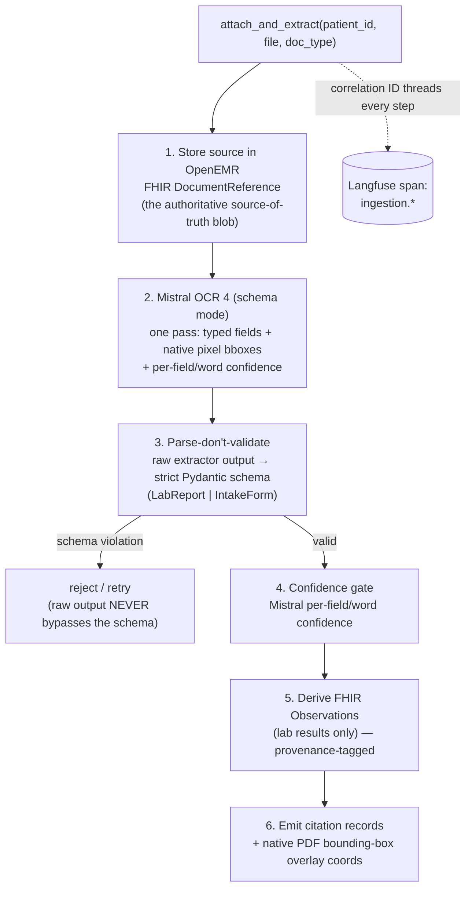
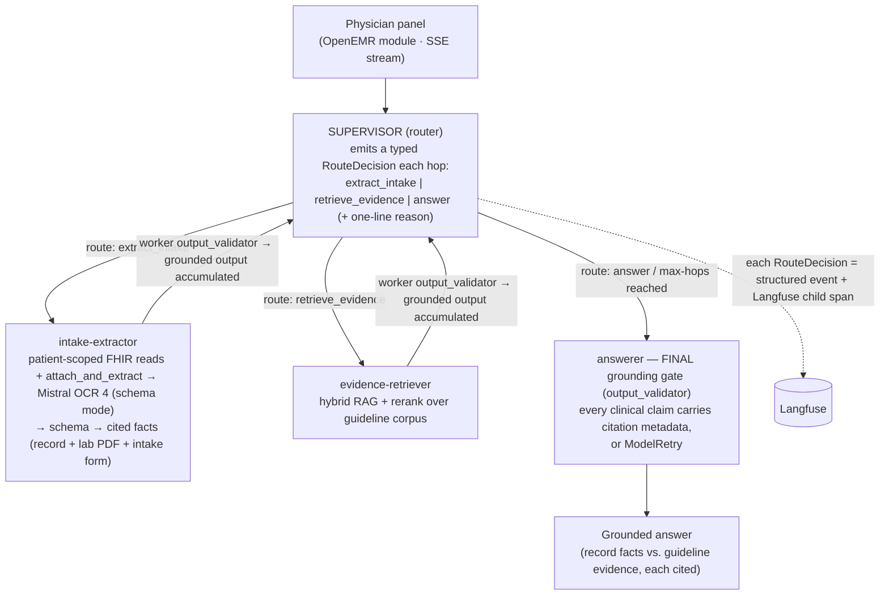
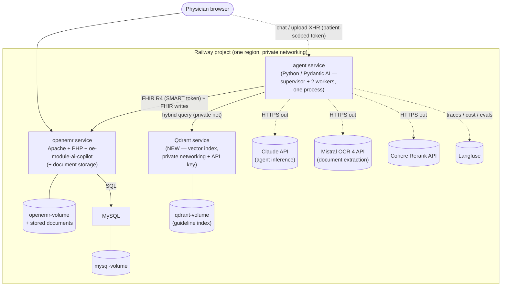

# Week 2 Architecture — AgentForge Clinical Co-Pilot (Multimodal Evidence Agent)

**Deliverable:** [`PRD-week-2.md`](PRD-week-2.md) "Week 2 Architecture Doc." This document
explains the **Week-2 delta only** — document ingestion, the supervisor/worker graph, hybrid
RAG, the eval gate, the Week-2 data model, observability, deployment, failure modes, and
tradeoffs. It does **not** repeat the Week-1 baseline: the deployment topology, authorization
model, FHIR data-access surface, verification gate, and Week-1 failure modes are established in
[`ARCHITECTURE.md`](ARCHITECTURE.md) and are cross-referenced by section number throughout
(e.g. "see [`ARCHITECTURE.md`](ARCHITECTURE.md) §5") rather than restated. Read that document
first; this one assumes it.

Detailed decision evidence — the roads not taken — lives in `/context/`:
[`agent-framework-week2.md`](context/decisions/agent-framework-week2.md) (Pydantic AI multi-agent),
[`vector-db-week2.md`](context/decisions/vector-db-week2.md) (Qdrant + Cohere), and the
[architecture-defense deck](context/planning/w2-arch-defense-deck.md). This document is the
source of truth; those back it.

> **Notation.** Acronyms are expanded on first use: **VLM** (Vision-Language Model), **RAG**
> (Retrieval-Augmented Generation), **RRF** (Reciprocal Rank Fusion), **BM25** (a sparse
> lexical ranking function), **PHI** (Protected Health Information), **IDOR** (Insecure Direct
> Object Reference), **FSM** (Finite-State Machine), **RPO/RTO** (Recovery Point / Time
> Objective), **SSE** (Server-Sent Events).

---

## 1. One-page summary

**What Week 2 adds.** Week 1 shipped a single conversational agent that reads *structured*
OpenEMR data over FHIR R4 and attributes every claim back to a row it actually fetched
([`ARCHITECTURE.md`](ARCHITECTURE.md) §§1, 6, 7). Week 2 teaches that agent to **see** the
documents clinicians actually receive — a scanned **lab PDF** and a front-desk **intake form** —
and to **route** that new work across a small multi-agent graph without losing grounding. Three
new capabilities, each a controlled expansion of a Week-1 seam rather than a replacement:

1. **Document ingestion.** A new `attach_and_extract(patient_id, file, doc_type)` tool stores the
   source document in OpenEMR as a `DocumentReference`, runs **Mistral OCR 4** (schema mode — typed
   fields + native pixel bounding boxes + per-word confidence in one pass) over it, validates the
   output against a **strict Pydantic schema** (the canonical contract — raw extractor output never
   bypasses it), and persists derived lab results as FHIR `Observation` resources. Every extracted
   fact carries a citation back to the source (§3).
2. **Supervisor + two workers.** The Week-1 single-agent verdict was pre-registered as
   *conditional*: [`ARCHITECTURE.md`](ARCHITECTURE.md) §6.1 named the exact tripwires that would
   flip it to multi-agent. Week 2 fires tripwire #3. We add a **supervisor** that routes to an
   **intake-extractor** worker and an **evidence-retriever** worker, with logged, inspectable
   handoffs (§4).
3. **Hybrid RAG with rerank.** A small clinical-guideline corpus, indexed in **Qdrant** with
   hybrid (dense + sparse, RRF-fused) retrieval and **Cohere** reranking, so answers separate
   patient-record facts from guideline evidence, each cited (§5).

**Decided stack at a glance** (Week-1 picks carry over unchanged — see
[`ARCHITECTURE.md`](ARCHITECTURE.md) §1):

| Concern | Week-2 decision | Evidence |
|---|---|---|
| Orchestration | **Pydantic AI** multi-agent (a router/supervisor agent emits a typed route each hop; plain Python dispatches the worker and loops) — *not* LangGraph | [`agent-framework-week2.md`](context/decisions/agent-framework-week2.md) |
| Document extraction | **Mistral OCR 4** (schema mode — typed fields + native pixel bboxes + per-word confidence, one pass) → strict Pydantic schema → OpenEMR `DocumentReference` + derived FHIR `Observation` | §3; [`vlm-extraction-week2.md`](context/decisions/vlm-extraction-week2.md) |
| Vector store | **Qdrant** (dedicated Railway service, private networking) | [`vector-db-week2.md`](context/decisions/vector-db-week2.md) |
| Hybrid retrieval | FastEmbed dense + sparse → Qdrant Universal Query API `Fusion.RRF` | [`vector-db-week2.md`](context/decisions/vector-db-week2.md) |
| Reranker | **Cohere Rerank** (`rerank-v4.0-fast`) | [`vector-db-week2.md`](context/decisions/vector-db-week2.md) |
| Eval gate | 50-case golden set · 5 boolean rubrics · **PR-blocking**, fails on >5% regression | §7 |
| Grounding | Week-1 `output_validator` + `ModelRetry` **ported to each worker + the final answer** | §4; [`ARCHITECTURE.md`](ARCHITECTURE.md) §7 |

**The through-line.** Week 2 is deliberately *narrower than the original spec* — two document
types, two workers, one regression gate — because the whole exercise is a test of whether the
architecture stays comprehensible while gaining multimodal input. Every addition reuses a Week-1
seam: the grounding gate becomes the per-worker citation enforcer, the correlation ID threads the
new spans, and the eval harness hardens into a hard CI gate. Nothing about Week 1 is thrown away.

---

## 2. What changed from Week 1

The single most important structural change is the move from **one agent** to a **supervisor +
two workers**. Week 1 did not pick a single agent by default — it derived the verdict bottom-up
from the use cases and *pre-registered the conditions that would reverse it*
([`ARCHITECTURE.md`](ARCHITECTURE.md) §6.1):

> Tripwires that would flip this to multi-agent: (1) UC-4 grows a per-flag adjudication step;
> (2) a UC needs branching durable state with a human-in-the-loop mid-flow; **(3) conflicting-
> source reconciliation becomes its own reasoning stage.**

**Week 2 fires tripwire #3.** The evidence-retriever is a distinct reasoning role — grounding an
answer in an external guideline corpus — that is separate from reading the patient's own record,
and separate again from extracting facts out of an uploaded document. That is three sources
(record, document, guideline) that must be reconciled into one cited answer, with a router
deciding which to consult. This is not a reversal of a Week-1 mistake; it is a **pre-planned
expansion firing on schedule**. The framework was chosen in Week 1 to be shape-neutral precisely
so this expansion would be additive.

| Dimension | Week 1 (baseline) | Week 2 (delta) |
|---|---|---|
| **Agents** | One conversational agent | Supervisor + intake-extractor + evidence-retriever |
| **Inputs** | Structured FHIR reads only (6 tools) | + unstructured lab PDF & intake form (document ingestion) |
| **Data written** | None (read-only agent) | Source `DocumentReference` + derived FHIR `Observation` |
| **Retrieval** | None (patient record only) | Hybrid RAG over a guideline corpus (Qdrant + Cohere) |
| **Grounding gate** | One `output_validator` on the single agent's answer | Same gate **ported to each worker** + the final answer |
| **Services on Railway** | OpenEMR · agent · MySQL | + **Qdrant** service · Cohere API · document storage |
| **`/ready`** | Pings FHIR, Claude, Langfuse | + vector index & reranker; returns **degraded**, not binary |
| **Eval harness** | 7 cases, report-only, runs on promotion PRs | **50 cases, 5 boolean rubrics, PR-blocking, >5% = fail** |
| **Correlation ID** | Threads one turn's tool loop | + ingestion, extraction call, retrieval, handoffs, FHIR writes |
| **Tracing** | Flat spans under one turn | Per-worker spans **nested under the supervisor span** |

**What did not change** (and why that matters): the deployment topology (Option D — PHP module +
standalone Python agent), the authorization model (patient-scoped SMART token minted in PHP, IDOR
unreachable through the agent), the FHIR-only data-access posture, and the verification *seam*
itself. Those are load-bearing and stable; see [`ARCHITECTURE.md`](ARCHITECTURE.md) §§3–7. Week 2
extends them; it does not touch them.

**Migration note (schema evolution).** Week 2 introduces new persisted artifacts (derived
`Observation` resources, guideline chunks, citation records) but **changes no Week-1 schema** —
the six FHIR read tools and their typed return models are untouched. The new writes are additive
FHIR resources tagged with provenance (§6), so there is no Week-1→Week-2 data migration and no
backwards-compatibility break in the existing tool contracts.

---

## 3. Document ingestion flow

The new tool is `attach_and_extract(patient_id, file, doc_type)`, supporting `doc_type ∈
{lab_pdf, intake_form}`. It is the intake-extractor worker's single tool. Its job: store the
source, see it, extract to a strict schema, and persist derived facts — with every fact traceable
to a location in the source document.

**Decided extractor: Mistral OCR 4 in schema mode**
([`vlm-extraction-week2.md`](context/decisions/vlm-extraction-week2.md)). It returns, in **one
pass**, each typed field with its **native pixel bounding box + page** and a **per-field / per-word
confidence** — the three things Core Reqs 2, 5, and 7 ask for. This replaces the previous plan of
Claude vision + a separate OCR pass + a fuzzy quote↔token match: there is **no separate OCR step
and no string-alignment heuristic on the critical path**. The choice is driven by Core Req 5's
pixel-accurate overlay requirement — Claude vision is the wrong tool for it (its Citations API
grounds to **page/section, not pixels**, and citations are **incompatible with structured output**,
returning 400), so a geometry-native extractor is cleaner than forcing Claude into the role. The
extractor's raw output is still **untrusted until validated into the strict Pydantic schema** (the
schema is the boundary), and the `output_validator` grounding gate still refuses any fact that
doesn't resolve to a source span. Mistral is a **managed external API** (like Cohere Rerank; §10),
wired into the same client/tracing surface. A possible fallback to revisit only if intake evals
regress is Claude vision for the reasoning-heavy free-text fields (§12) — not built now.

### 3.1 The flow



1. **Store the source first.** The uploaded file is written to OpenEMR as a FHIR
   `DocumentReference` *before* any extraction. This is the authoritative, immutable copy — the
   thing every citation ultimately points at (§6). Storing first means an extraction failure
   never loses the document.
2. **Extraction pass (one call).** **Mistral OCR 4 in schema mode** reads the page(s) and returns,
   in a single pass, each typed field with its **native pixel bounding box + page** and a
   **per-field / per-word confidence**. The extractor is given the target schema so its output is
   shaped, but its output is treated as **untrusted** until step 3. No separate OCR pass and no
   quote↔token match are needed — the geometry is native.
3. **Parse, don't validate.** Raw extractor output is parsed into a strict Pydantic model
   (`LabReport` for `lab_pdf`, `IntakeForm` for `intake_form`). Per the PRD Engineering
   Requirements, **the schema is the source of truth, not what the extractor happens to return** —
   a field it invents that isn't in the schema is dropped; a required field it omits fails
   validation and triggers a bounded retry. This is the same "parse at the boundary" discipline
   Week 1 applies to FHIR reads ([`ARCHITECTURE.md`](ARCHITECTURE.md) §4).
4. **Confidence gate.** Confidence is the extractor's **native per-field / per-word signal**. A
   field returned with low confidence — or that doesn't resolve to a source span — is exactly the
   low-confidence / unsupported case: surfaced to the physician, never dropped and never presented
   as certain. It is treated as a **low-confidence refusal** by the `output_validator` gate
   (§4.3, §11), not a silent guess.
5. **Derive FHIR Observations.** For `lab_pdf`, each validated lab result becomes a FHIR
   `Observation` (test name, value, unit, reference range, collection date, abnormal flag),
   tagged with provenance pointing back to the source `DocumentReference` (§6). Intake facts are
   persisted as appropriate OpenEMR records, not as Observations.
6. **Citations + overlay.** Every derived fact emits a citation record and, for PDFs, the
   bounding-box coordinates for the click-to-source overlay (§3.3).

### 3.2 The two schemas (canonical contracts)

Both are strict Pydantic v2 models; a source citation field is **mandatory on every extracted
fact** — a fact without a citation is a schema violation, not a warning.

- **`LabReport`** (per `lab_pdf`) — required fields include, at minimum: test name, value, unit,
  reference range, collection date, abnormal flag, and source citation.
- **`IntakeForm`** (per `intake_form`) — required fields include, at minimum: demographics, chief
  concern, current medications, allergies, family history, and source citation.

These schemas are the **canonical contract** for the ingestion boundary and are contract-tested
in CI (§7, §8). The Pydantic definitions and their validation tests are a separate PRD deliverable.

### 3.3 The citation contract

Every clinical claim in the final answer — extracted *or* retrieved — carries machine-readable
citation metadata in one shape:

```
{ source_type, source_id, page_or_section, field_or_chunk_id, quote_or_value }
```

| Field | For an extracted document fact | For a retrieved guideline snippet |
|---|---|---|
| `source_type` | `lab_pdf` / `intake_form` | `guideline` |
| `source_id` | the `DocumentReference` ID | the corpus document ID |
| `page_or_section` | PDF page number | section heading |
| `field_or_chunk_id` | the schema field name | the Qdrant chunk ID |
| `quote_or_value` | the extracted value (verbatim) | the retrieved snippet text |

For `lab_pdf`, the citation additionally records the **bounding-box coordinates** on the page —
emitted **natively by Mistral OCR 4** alongside each typed field (§3, §3.1), not reconstructed by a
match step. The click-to-source UI renders a visual **bounding-box overlay** on the stored PDF —
the physician clicks a cited lab value and sees exactly where on the scan it came from. The
citation is not merely *present*, it is *locatable on the source*; a field the extractor returns
without a resolved box (or below the confidence floor) is a low-confidence refusal (§11), never a
fabricated rectangle.

**Two citation shapes, layered — not competing.** The gate-internal grounding reference and this
canonical wire contract are two **layers** of the same mechanism, not rival formats. The
**grounding reference** is gate-internal: it resolves a structured field or a verbatim quote
against the source and stamps the real value (§4.3). The **canonical `Citation`** above —
`{source_type, source_id, page_or_section, field_or_chunk_id, quote_or_value}` — is what the
click-to-source UI consumes. The final answer grounds each claim via the internal reference, then
emits the canonical `Citation` per claim: `source_type = guideline` for corpus claims,
`openemr_record` for record claims; the `lab_pdf` / `intake_form` document citations (with
bounding boxes) come from the ingestion path (§3.1).

### 3.4 Extraction is a one-time transform — re-extraction & idempotency

Extraction is a **one-time transform, not a per-turn operation.** The pipeline in §3.1 runs
**once per document version.** The first time the intake-extractor needs facts from a document it
runs the full pipeline; on every later turn those facts are already **structured chart data**
(persisted records) plus a **cached extraction result**, so the worker *reads* them — it does not
re-invoke the VLM. Re-reading a scanned PDF on every follow-up question would be slow, costly, and
a fresh chance to hallucinate; there is no reason to, because the transform's output is durable.

**The idempotency key is the source document's stable ID** — the *same* `source_id` the citation
contract already carries (§3.3). One provenance tag does three jobs: **citation, idempotency, and
lineage.** The guard is a check-the-destination-before-writing step:

```
intake-extractor needs facts from document X:
  1. Does an extraction result already exist for (doc-X id, content hash)?
  2. YES → read persisted facts + cached citations. Skip VLM, skip persist.
  3. NO  → extract → validate → persist (provenance = doc-X) → cache the extraction result.
```

- **Content hash guards re-uploads.** The key is `(document id, content hash)`, not the id alone.
  A corrected re-upload changes the hash and is extracted as a **new version**; the prior facts
  stay traceable to the prior version, so nothing becomes *untraceable* (§6).
- **Why cache the whole extraction result, not just the facts.** A persisted lab `Observation`
  carries the *value* but **not the pixel bounding box** the click-to-source overlay needs. So the
  full extraction result — typed facts *plus* page/bbox citations — is stored as a **sidecar**
  (§6), and re-rendering the overlay on a later turn reads the sidecar rather than re-running
  Mistral OCR 4.
- **Concurrency.** Two turns touching an un-extracted document at once could double-write; a
  per-document lock (or an upsert keyed on `provenance + field`) makes first-touch extraction
  safe. Low-risk at demo scale, called out so it is a decision, not an accident.

---

## 4. Worker graph — supervisor + two workers

### 4.1 Shape



The supervisor is a **procedural router loop**, not tool-delegation. A dedicated
**router/supervisor agent** emits a typed **`RouteDecision`** each hop — a closed enum of three
routes (`extract_intake`, `retrieve_evidence`, `answer`) plus a one-line reason. Plain Python then
dispatches the chosen worker (intake-extractor or evidence-retriever), accumulates its grounded
output, and loops — re-invoking the router with the accumulated state — until the router decides
`answer` or a **max-hops ceiling** is hit (at which point it composes an answer anyway rather than
looping). The flow is shallow and near-linear — the PRD's own word is *small graph* — which is
exactly why a full `StateGraph` (LangGraph) is machinery we would pay for now and grow into
later ([`agent-framework-week2.md`](context/decisions/agent-framework-week2.md)). The workers
are:

- **intake-extractor** — owns the **full patient-scoped FHIR read toolset** (demographics,
  problems, medications, allergies, encounters, and free-text encounter notes) **plus**
  `attach_and_extract` (§3). It therefore **fully subsumes the Week-1 single agent**, which has
  been **removed from the request path** — the supervisor graph is now the **only** `/chat`
  behavior. Turns an uploaded document, or the patient's own record, into schema-valid, cited facts.
- **evidence-retriever** — owns the hybrid RAG tool (§5). Turns a clinical question into ranked,
  cited guideline snippets.

### 4.2 Inspectable, logged handoffs

The single biggest risk of picking Pydantic AI over LangGraph is that its routing is *procedural
Python* rather than a rendered graph object, so a grader who equates "inspectable routing" with
"a labeled-edge diagram" could read a procedural router loop as less inspectable
([`agent-framework-week2.md`](context/decisions/agent-framework-week2.md), "single biggest
risk"). We answer that by making routing legible **in the trace**:

- **Structured route events.** Every hop's routing decision is a typed **`RouteDecision`** — the
  chosen route (`extract_intake` / `retrieve_evidence` / `answer`) plus a one-line reason — logged
  as a structured event with its correlation ID. The PRD requires that handoffs be "logged and
  explainable" — this is that log.
- **Langfuse child spans.** Each **route decision** is a **child span under the turn span**, and
  the worker it dispatches is a child span in turn (§9), so the full hand-off chain is
  reconstructable from the correlation ID alone. The routing is inspectable in the trace even
  though it is expressed in code.
- **Escalation path.** If routing later needs an explicit, diagrammable FSM, `pydantic-graph`
  gives one *inside the same framework* — no cross-framework migration
  ([`agent-framework-week2.md`](context/decisions/agent-framework-week2.md)).

### 4.3 Grounding gate ported to the workers

Week 1's crown-jewel verification seam — `@agent.output_validator` + `ModelRetry`
([`ARCHITECTURE.md`](ARCHITECTURE.md) §7) — is a *per-agent* pre-return hook. Because it survives
the framework unchanged, we attach it in **three** places rather than one — all three backed by
**one shared citation-resolver abstraction** (resolve a claim against its source, or refuse):

1. **On the intake-extractor** — a **FHIR fetch-log resolver** for record claims: reject any
   record claim that doesn't resolve to a logged FHIR fetch, and any extracted document fact that
   doesn't resolve to a source span (a native bbox + page from Mistral OCR 4, above the confidence
   floor; the schema + citation + extractor geometry enforce this together; §3). This is the
   "vision extraction without invention" mandate, mechanically enforced.
2. **On the evidence-retriever** — a **guideline chunk-registry resolver**: reject an evidence
   claim without chunk metadata (`source_id` / `chunk_id`) resolvable in the corpus registry.
3. **On the final answer** — a **composite of both resolvers**: reject any clinical claim lacking
   the full citation shape (§3.3), exactly as Week 1 did for the single agent.

**One seam, reused three times, not rebuilt** — a single citation-resolver abstraction with a
FHIR-fetch-log implementation for record claims, a chunk-registry implementation for evidence
claims, and a composite of the two for the final answer. This is the mechanical enforcement of the
Week-2 citation contract and the `citation_present` / `factually_consistent` eval rubrics (§7).
Failure direction remains **refusal, not silent pass**: an unattributable answer degrades to "the
record doesn't support that" rather than shipping ([`ARCHITECTURE.md`](ARCHITECTURE.md) §7).

---

## 5. RAG design

**The corpus is small and static** — a curated set of clinical-guideline chunks the office
follows, each carrying source metadata. Raw scale is not the deciding axis; native hybrid
quality, Railway footprint, and metadata filtering are
([`vector-db-week2.md`](context/decisions/vector-db-week2.md)).

### 5.1 The pipeline

```
Guideline corpus (curated chunks · payload = {guideline, source, section})
   │  FastEmbed inside qdrant-client: dense embed + sparse (bm25 / minicoil)
   ▼
Qdrant  (dedicated Railway service · private networking)
   │  Universal Query API: prefetch(dense) + prefetch(sparse) → Fusion.RRF → top-k
   ▼
Cohere Rerank  (rerank-v4.0-fast)  → keep top-n grounded snippets
   ▼
Answer model  ← receives ONLY the reranked evidence + source metadata
   ▼
output_validator gate — no unattributable evidence claim ships
```

Each choice traces to a requirement
([`vector-db-week2.md`](context/decisions/vector-db-week2.md)):

- **Native hybrid in one API call.** PRD Core Req 3 asks literally for "sparse+dense search,
  rerank." Qdrant's Universal Query API prefetches a dense vector (semantic) and a sparse vector
  (lexical) and fuses them with **`Fusion.RRF`**. RRF is **rank-based**, so it sidesteps the
  score-scale mismatch between bounded cosine similarity and unbounded BM25 — there is **no alpha
  weight to tune or defend**. This is the seam a grader will poke, and it is a documented feature,
  not glue code.
- **One added service, not two.** FastEmbed ships inside `qdrant-client` and generates *both* the
  dense and sparse vectors in-process — no separate embedding service, no separate sparse encoder.
  The whole retrieval stack is one new Railway service plus a library, and it yields a **real
  `/ready` vector-index dependency** (§10) that an in-process store can't offer.
- **Metadata filtering.** Qdrant payload filters scope retrieval by `guideline` / `source` /
  `section`, which is also what populates the citation contract's `source_id` / `page_or_section`
  (§3.3).
- **Reranker.** Cohere `rerank-v4.0-fast` — the PRD-named default, ~$2/1k searches (rounding error
  on a small corpus), pinned to a v4.0 model (`rerank-3.5` is deprecated). Config-level swap to
  Voyage or Jina if the latency report puts rerank on the critical path.

**Implementation status (JOS-53).** The pipeline above is built in `agent/src/copilot/rag/`
(`retriever.py` hybrid+rerank, `index.py` content-correct indexer, `corpus.py`, `models.py`),
with the concrete choices: dense `BAAI/bge-small-en-v1.5` (384-dim), sparse `Qdrant/bm25`
(IDF), `prefetch_k=20`, `rerank_top_n=5`. Retrieved snippets carry the §3.3 `guideline`
citation arm; `/ready` now probes Qdrant (`/readyz`) and Cohere (§10). Design contract:
[`context/specs/hybrid-rag-pipeline.md`](context/specs/hybrid-rag-pipeline.md). The retriever
is a standalone capability this increment; **weaving evidence into the final answer and the
`output_validator` gate shown above is the JOS-56 supervisor/worker graph** (§4), which consumes
this retriever and enforces the evidence guardrail at the worker level.

### 5.2 The sophistication ladder — where we stopped, and why

The governing principle is **match solution complexity to problem complexity** — do not default
to the fanciest RAG ([`vector-db-week2.md`](context/decisions/vector-db-week2.md), citing
Gallant). The ladder, with where we sit:

| Rung | Us |
|---|---|
| Naive vector search | baseline |
| Metadata filtering (scope to guideline / source / section) | ✓ |
| Hybrid: dense + sparse (BM25), RRF-fused | ✓ |
| Rerank the fused candidates (Cohere) | ✓ |
| Query rewriting / multi-hop | **defer** — PRD-optional; add only if evals show misses |
| Graph RAG (entity-relationship knowledge graph) | **not needed** — small, flat corpus |
| Agentic RAG (supervisor routes to retrieval tools) | ✓ — earned from the multi-agent decision |

We land on **hybrid + metadata + rerank, exposed as tools the supervisor routes to** — and that
routing *is* the Agentic-RAG rung, earned from the §4 decision rather than bolted on. We stop
short of Graph RAG and multi-hop **on purpose**: their cost, latency, and non-determinism buy
nothing on a few-hundred-chunk flat corpus.

> **Runtime modes.** The §5.1 pipeline runs as built in **`QDRANT` mode** (the deployed default):
> the live Qdrant + Cohere hybrid retriever grounds the evidence-retriever. A **`FIXTURE` mode**
> runs an in-process keyword retriever over the same real in-repo corpus (55 chunks) — no network,
> no Docker — for tests and offline dev, mirroring `FhirClientMode.FIXTURE`. Both satisfy the one
> `EvidenceRetriever` interface, so the supervisor graph is identical in either mode; `/ready`
> surfaces a degraded Qdrant/Cohere dependency and the service falls back to the fixture retriever
> rather than failing to answer.

> **Terminology guard.** "Graph" in this project means the **agent orchestration graph**
> (supervisor → workers, §4) — **not** Graph RAG (a knowledge graph over entities). Our retrieval
> is hybrid vector+lexical, not entity-graph. The two uses of "graph" are unrelated.

---

## 6. Data model & authority

Week 2 introduces five artifact types. Each has exactly **one source of truth**, explicit
lineage, defined access control, and validation rules — **no silent overwrites** (PRD Engineering
Requirements, "data authority must be explicit").

| Artifact | Authoritative owner | Lineage (where it came from) | Access | Validation |
|---|---|---|---|---|
| **Extracted lab observations** | OpenEMR — FHIR `Observation` | Derived from a stored `DocumentReference` via Mistral OCR 4 extraction; provenance tag points back to the source | Same patient-scoped SMART read as all FHIR data ([`ARCHITECTURE.md`](ARCHITECTURE.md) §5) | `LabReport` schema; abnormal-flag + reference-range sanity checks |
| **Intake facts** | OpenEMR (demographics / meds / allergies / family history records) | Derived from a stored `DocumentReference` via extraction | Patient-scoped | `IntakeForm` schema |
| **Guideline chunks** | The **versioned corpus in the repo** (indexed into Qdrant) | Curated from published guidelines; reproducible from the repo alone (§11) | Non-PHI; read by the evidence-retriever | Chunk must carry `{guideline, source, section}` metadata |
| **Citation records** | The agent (emitted per claim) | Composed from an extraction or a retrieval result; for `lab_pdf`, the page + pixel bbox are **native output of Mistral OCR 4**, not a reconstructed rectangle | Rides with the answer payload | Must satisfy the full citation shape (§3.3); a `lab_pdf` citation whose field lacks a resolved bbox is refused, not shipped with a fabricated box |
| **Extraction-result cache (sidecar)** | Derived cache — **rebuildable**, not a system of record | One extraction pass over a stored source document; keyed to `(document id, content hash)` (§3.4) | Same patient scope as the source document it derives from | Holds the validated facts + page/bbox citations; superseded when the source version (hash) changes |

**Qdrant is authoritative for nothing patient-specific** — it holds only the non-PHI guideline
corpus, and that corpus is reproducible from the repo, so Qdrant is a rebuildable index, not a
system of record. **OpenEMR remains the single source of truth for all patient data**, exactly as
in Week 1.

**FHIR round-trip without duplicate or untraceable records.** The PRD requires that uploaded
documents and derived observations "round-trip through OpenEMR without creating duplicate or
untraceable records." We enforce this by:

- **Store-once.** The source document is written as exactly one `DocumentReference`; re-running
  extraction on the same document does not create a second source blob.
- **Provenance link.** Every derived `Observation` is tagged with a reference to the
  `DocumentReference` it came from — so no derived record is *untraceable*, and the chain
  `Observation → DocumentReference → cited page/bbox` is always walkable.
- **Idempotent derivation — check the destination first.** Before extracting or persisting, the
  worker checks whether an extraction result already exists for `(document id, content hash)`
  (§3.4). If it does, it reads the persisted facts and cached citations instead of re-running the
  VLM or re-inserting Observations; if it does not, it extracts once and records provenance. This
  is what makes the "one-time transform" (§3.4) safe to trigger from a chat turn without
  duplicating records.
- **Where the cache lives — sidecar in OpenEMR, not a new agent datastore.** The extraction result
  (facts + page/bbox citations) is stored **alongside the source in OpenEMR**, linked to the source
  document, rather than in a database owned by the agent service. The agent deliberately holds no
  datastore of its own ([`ARCHITECTURE.md`](ARCHITECTURE.md) — FHIR-only, no DB credentials); a
  private ledger would add a second source of truth to reconcile. Keeping the sidecar in OpenEMR
  preserves **one system of record** and lets the whole per-document state (source + facts +
  citations) be recovered together (§11). The trade-off — an OpenEMR read to check extraction
  status instead of an O(1) local lookup — is negligible at this scale.

---

## 7. Eval gate

> **HARD GATE.** During grading, a small regression will be injected and the CI gate must fail.
> A working demo that cannot block a regression has not met the Week-2 standard (PRD).

**From Week 1 to Week 2.** Week 1 shipped 7 cases across 3 fixture patients, scored by 4
evaluators, in a **report-only** CI workflow that ran only on `qa → main` promotion PRs
([`ARCHITECTURE.md`](ARCHITECTURE.md) §11, `should_fail_on_regression: false`). Week 2 hardens
this into the gate the PRD demands:

- **50-case golden set** exercising extraction, evidence retrieval, citations, refusals, and
  missing-data behavior.
- **Five boolean rubrics** (booleans, not 1–10 ratings, so failures are actionable):
  `schema_valid` · `citation_present` · `factually_consistent` · `safe_refusal` ·
  `no_phi_in_logs`.
- **PR-blocking git hook / CI job.** The suite runs on every PR and **blocks the merge** if any
  rubric category **regresses by more than 5%** or drops below its pass threshold.

| Rubric | Boolean question it answers | Guards against |
|---|---|---|
| `schema_valid` | Did extraction conform to the `LabReport`/`IntakeForm` schema? | Raw extractor output bypassing the canonical contract (§3) |
| `citation_present` | Does every clinical claim carry the full citation shape? | Uncited claims reaching the physician (§3.3) |
| `factually_consistent` | Does the cited source actually support the claim? | Misattribution / subtly-wrong synthesis ([`ARCHITECTURE.md`](ARCHITECTURE.md) §15) |
| `safe_refusal` | Did the agent refuse when the data doesn't support an answer? | Fabrication on sparse/missing records |
| `no_phi_in_logs` | Are traces/logs/eval output free of PHI? | The disqualifying failure — PHI leaking to observability (§9) |

**Why this is the gate that matters:** graders actively try to break it. The build failing on a
>5% category regression is the mechanism that makes "we prove quality with a CI gate" true rather
than aspirational. The golden set is **reproducible from the repo alone** (§11) — it does not live
only in a database with no recovery path.

---

## 8. Testing strategy

Every test is classified by layer and documented with **the failure mode it guards against** (PRD
Engineering Requirements). Integration tests run in CI **without live API access** by stubbing
LLM and Mistral OCR 4 extractor responses against fixture documents.

| Layer | What it covers | Failure mode it guards |
|---|---|---|
| **Unit** | `LabReport` / `IntakeForm` schema validators; citation-shape validator; the `attach_and_extract` tool's pure logic; **extractor-output schema-conformance + bbox-presence validation** against fixture Mistral OCR 4 responses; RRF/rerank result-shaping | A schema silently accepting a malformed or uncited extraction; a citation record missing a required field; an extracted field reaching the overlay without a native bbox / with sub-floor confidence, or such a field not being flagged as a refusal (§11) |
| **Unit** | Supervisor route-decision logic (which worker for which request) | Routing regressions — the supervisor sending extraction work to the retriever or vice versa |
| **Integration** | Full **ingestion→answer path** with fixture PDFs/form images and a **stubbed Mistral OCR 4 extractor** (fixture schema-mode responses — typed fields + native bboxes + confidence) | The store→extract→derive→cite chain breaking at a seam (e.g. a derived Observation losing its provenance link, §6; a native bbox failing to thread into the citation record) |
| **Integration** | RAG pipeline: FastEmbed → Qdrant hybrid → Cohere rerank, against a fixture corpus | Retrieval returning wrong/empty results, or fusion/rerank silently degrading |
| **Integration** | Supervisor↔worker **contract tests** (typed handoff payloads) | A handoff payload drifting from its Pydantic contract — the interface breaking undetected |
| **Eval (golden set)** | Agent *behavior* — the 5 rubrics over 50 cases (§7) | The behavioral regressions the hard gate exists to catch |
| **CI meta** | Dependency audit + security scan on every PR; **PHI-detection check** on logs/traces/eval data | Vulnerable dependencies shipping; PHI leaking into observability (§9) |

**Not tested, and why:**

- **Live extractor / LLM / reranker accuracy** is *not* asserted in unit/integration tests — it is
  non-deterministic and would make CI flaky and network-dependent. Its quality is instead measured
  by the **golden-set evals** (§7), which is the correct instrument for probabilistic behavior.
- **OpenEMR core and the FHIR server** are not re-tested — they are upstream, covered by the
  fork's own suite, and unchanged by Week 2.
- **Qdrant/Cohere internals** are not tested — they are third-party services; we test *our*
  integration against them (with stubs in CI, live only in the eval run).
- **Framework-enforced invariants** are not re-asserted — if Pydantic guarantees a required field,
  we don't write a test proving it's required (that tests the framework, not our code).

---

## 9. Observability

Week 2 **extends** the Week-1 observability seam ([`ARCHITECTURE.md`](ARCHITECTURE.md) §10) — same
Langfuse, same correlation-ID discipline, same structured-log format. No parallel logging
convention is introduced; the Week-1 log schema gains new event types.

- **Route-decision and per-worker spans nested under the turn span.** Each supervisor **route
  decision** is emitted as its own **Langfuse child span** under the turn span, carrying the chosen
  route (`extract_intake` / `retrieve_evidence` / `answer`) and its one-line reason; the worker it
  dispatches (intake-extractor, evidence-retriever) is a child span in turn, with the extraction
  and retrieval sub-calls traceable *within* their worker spans. The full hand-off chain is
  reconstructable **from the correlation ID alone** — the PRD's explicit distributed-tracing
  requirement.
- **Correlation-ID propagation into the new boundaries.** The Week-1 correlation ID
  ([`ARCHITECTURE.md`](ARCHITECTURE.md) §10) now threads through **ingestion** (document
  upload/extract), **worker handoffs**, the **extraction call**, **retrieval calls**, and **FHIR writes**
  (the derived Observations). A grader reconstructs a full Week-2 request trace with the
  correlation ID and nothing else.
- **New structured events & metrics.** Document ingestion start/complete, extraction outcome
  *per field*, **Mistral OCR 4 per-field / per-word confidence per document**, **bbox-presence
  outcome per field** (native box resolved vs. missing), retrieval hit/miss, supervisor routing
  decision, worker handoff, and eval-run outcome — added to the Week-1 log schema, searchable by
  case ID / event ID / correlation ID. Dashboard gains: ingestion count & latency, extraction
  field-level pass rate, **bbox-presence rate** (the extractor-quality metric that trips the
  fallback, §12), retrieval hit rate, routing-decision breakdown, eval pass/fail per category.
- **New cost drivers, watched.** Week 2 adds a document-extraction pass (Mistral OCR 4), embedding,
  reranking, and extra inference hops. Tiered Claude routing (Haiku / Sonnet / Opus) on the agent
  side is the lever that keeps the <15s budget and the cost curve defensible
  ([`ARCHITECTURE.md`](ARCHITECTURE.md) §12) rather than flat token×N.
- **PHI-free traces — the disqualifier.** No raw document text, no patient identifiers, and no
  extracted clinical *values* reach traces, logs, eval datasets, or cost reports. This extends
  the Week-1 single de-identification seam ([`ARCHITECTURE.md`](ARCHITECTURE.md) §9) to the new
  PHI surfaces (document images and extracted fields). Document images go to Mistral OCR 4 under
  BAA for extraction (§10), but never to the observability plane: confidence *scores* and bbox
  *coordinates* are safe to trace, the underlying text and images are not. The `no_phi_in_logs`
  rubric (§7) plus a CI PHI-detection check (§8) verify it mechanically — logging PHI to a SaaS
  observability tool is the named disqualifying failure.

---

## 10. Deployment topology

Week 2 adds services to the Week-1 Railway project without changing the two-concern split (PHP
module + standalone Python agent — [`ARCHITECTURE.md`](ARCHITECTURE.md) §3). Critically, **the
agent stays one Pydantic AI service** — the supervisor and both workers run in-process; no new
agent service is spun up for the multi-agent shape.



**New on Railway:** a **Qdrant** service (one-click template, volume pre-mounted, reachable over
private networking with an API key), two **external managed APIs** — **Cohere Rerank** and
**Mistral OCR 4** (document extraction), both over HTTPS — and **document storage** (on the OpenEMR
volume, as `DocumentReference` blobs).

**Mistral OCR 4 is an external managed dependency.** Document extraction (§3) is a hosted API call,
like Cohere Rerank — not an in-process library. It adds **no new Railway service** but **is a
network dependency**, so it joins the `/ready` reachability probes below, and document images are
sent under BAA (PHI leaves the agent process for extraction, exactly as FHIR reads and inference
calls already do). **Self-hosting is the scale option**: Mistral OCR 4 can run in a single
container if volume or latency later justifies bringing it in-network — a contained change behind
the same schema boundary.

**`/ready` becomes dependency-aware — degraded, not binary.** Week 1's `/ready` pinged FHIR,
Claude, and Langfuse ([`ARCHITECTURE.md`](ARCHITECTURE.md) §10). Week 2 adds probes for **document
storage**, the **Qdrant vector index** (ping its private URL), **Cohere reranker reachability**, and
**Mistral OCR 4 extractor reachability**. `/ready` returns a **per-dependency degraded status**, not
a binary up/down: if the reranker is unreachable but Qdrant, the extractor, and FHIR are up, the
system reports *degraded* (retrieval works, reranking doesn't) rather than a blanket 503. `/health`
is unchanged — 200 if the process is alive. The two endpoints stay genuinely separate.

---

## 11. Failure modes & recovery

This section **extends** [`ARCHITECTURE.md`](ARCHITECTURE.md) §8 (Week-1 failure modes, all still
in force) with the five new Week-2 failure modes. Each entry states **how to identify it in the
logs** and **the recovery action** (PRD Engineering Requirements).

| Failure mode | How to identify in logs | Recovery action |
|---|---|---|
| **Document ingestion / storage failure** (upload or `DocumentReference` write fails/times out) | `ingestion.start` with no matching `ingestion.complete` for the correlation ID; `/ready` shows document storage degraded | Source is stored *before* extraction, so a downstream failure never loses the document; if storage itself fails the tool returns a typed error and the agent reports "couldn't save the document," never fabricates around it. |
| **Extraction schema violation** (extractor output fails `LabReport`/`IntakeForm` validation) | `schema_valid=false` on the extraction event; retry count on the extractor span | Raw output is rejected (never persisted). A bounded retry feeds the specific violation back; if still invalid, the field is surfaced as *unextracted / low-confidence* rather than guessed (§3). |
| **Document-extraction failure** (Mistral OCR 4 errors/times out, or returns only low-confidence fields) | timeout / error on the extractor span; `/ready` shows Mistral OCR 4 unreachable; per-field confidence below the floor on the extraction event | Bounded retries with explicit timeouts on the extractor call; on hard failure the tool returns a typed error and the agent reports "couldn't read the document," never guesses. A field below the confidence floor (or without a native bbox) is a **low-confidence refusal** (§3, §4.3), surfaced as unextracted rather than presented as certain. A sustained low-confidence rate on the eval bar is the documented tripwire to revisit a reasoning-VLM fallback (§12). |
| **Empty retrieval** (hybrid RAG returns no grounded evidence) | `retrieval hit=false` / zero candidates on the evidence-retriever span; retrieval-hit-rate metric drops | The evidence-retriever returns "no supporting guideline found"; the grounding gate (§4.3) blocks any evidence *claim* without a chunk citation, so the answer separates "record says X" from "no guideline evidence retrieved" rather than inventing a guideline. |
| **Supervisor routing error** (routes to the wrong worker, or loops) | The structured route event (which worker, why) diverges from the request intent; per-worker span pattern is anomalous (e.g. extractor invoked on a pure-question turn) | Routing decisions are logged as inspectable events (§4.2); a per-turn worker-invocation ceiling bounds loops (extending Week-1's tool-call ceiling, [`ARCHITECTURE.md`](ARCHITECTURE.md) §8); the contract tests (§8) catch routing regressions pre-merge. |

**Backup & recovery.** The design keeps every Week-2 artifact recoverable:

- **Guideline corpus + Qdrant index** — the corpus lives in the **repo** (versioned); the Qdrant
  index is a *rebuildable derivative*, re-indexed from the repo by a single command. **RPO for the
  index ≈ 0** (nothing unique lives only in Qdrant); **RTO** = the re-index run time (minutes on a
  small corpus).
- **Golden eval set** — lives in the repo, **reproducible from the repo alone** (PRD requirement);
  it does not depend on any database with no recovery path.
- **Stored documents + derived FHIR records** — persist on the OpenEMR volume / MySQL and inherit
  OpenEMR's backup path; derived Observations are re-derivable from the retained source
  `DocumentReference` if lost (re-run `attach_and_extract`), because the source is stored first and
  immutably (§3, §6).
- **Manual recovery** — if automated backup fails: re-index Qdrant from the repo corpus; re-run
  extraction from the retained source documents; the eval set and schemas need no recovery (they
  are the repo).

---

## 12. Risks & tradeoffs + rejected alternatives

Stated plainly, because a doc that names its own edges is the one worth trusting. These are the
verbal talking points from the architecture defense, recorded here as the risk register.

| Risk / tradeoff | The exposure | Mitigation |
|---|---|---|
| **Extraction error / hallucination** | A doc-AI extractor can mis-read field labels or overstate confidence on a scanned form | The strict schema is the contract (raw output never bypasses it, §3); every field must carry a native bbox + page above the confidence floor or it is refused (§3, §4.3); per-field/word confidence surfaces unsupported fields; `schema_valid` + `citation_present` rubrics gate it (§7) |
| **Weak semantics on free-text intake** | Mistral OCR 4 is OCR-first — strong on structured lab tables and form fields, weaker at normalizing free-text intake (units, reference ranges, abnormal-flag reasoning, free-text chief concern) than a reasoning VLM | Strict schema + `output_validator` refuse any unsupported field rather than guess; the `factually_consistent` / `schema_valid` rubrics on the **intake** cases are the tripwire. If the intake path fails the eval bar, the option to revisit is **Claude vision** for the reasoning-heavy fields, swapped in behind the same schema boundary — not built now |
| **Black-box supervisor** | Delegation-via-tool-call is procedural, not a rendered graph — routing could read as opaque | Every route decision is a structured, logged event + a Langfuse child span (§4.2); `pydantic-graph` is the in-framework escalation to an explicit FSM if needed |
| **Scope creep** | The pull to support five document types before two work reliably | Ship **two** document types and **two** workers first; a third doc type is explicitly PRD-*optional* extension work, not core |
| **Multi-agent latency vs. <15s** | Extra inference hops (supervisor + workers + extraction + rerank) threaten the Week-1 <15s budget ([`ARCHITECTURE.md`](ARCHITECTURE.md) §2) | Routing discipline (only consult the worker the request needs); SSE streaming to first token; tiered Claude routing keeps cost and latency defensible; RRF/rerank latency measured in the cost/latency report |
| **PHI leakage into observability** | The **disqualifying** failure — raw document text, identifiers, or extracted values reaching traces/logs/evals | Extend the single de-identification seam ([`ARCHITECTURE.md`](ARCHITECTURE.md) §9) to the new PHI surfaces; `no_phi_in_logs` rubric + CI PHI-detection check verify it mechanically (§§7–9) |

**Rejected alternatives** (brief — full reasoning in the decision docs):

- **LangGraph** (runner-up orchestration) — a reasonable multi-agent default and it owns one thing
  outright: a rendered graph object. Rejected for *this* flow because our graph is shallow and
  near-linear, and adopting it would force a **rebuild of the crown-jewel grounding gate** (it has
  no validate-then-retry primitive) plus a port of every tool to a node — spending the sprint
  porting Week-1 surface area instead of building Week-2 capability. The pick stays reversible:
  we'd switch the moment routing needs durable resumable state or human-in-the-loop mid-flow
  ([`ARCHITECTURE.md`](ARCHITECTURE.md) §6.1 tripwires #1/#2). Full analysis:
  [`agent-framework-week2.md`](context/decisions/agent-framework-week2.md).
- **Claude vision + local OCR + quote↔token match** (the previous §3 plan for document
  extraction) — extract with Claude vision, localize with a deterministic local OCR word-box pass,
  and glue them with a fuzzy quote↔token match to produce the bbox overlay. Rejected for **bbox
  fragility and three-part complexity**: the overlay rode a string-alignment heuristic on the
  critical path (a normalized value could miss its box), and it stood up an OCR pass + match layer
  purely to work around Claude's page-level-only citations. **Mistral OCR 4** returns typed fields +
  native pixel bboxes + per-word confidence in one pass instead (§3). Claude vision remains the
  **fallback to revisit only if intake evals regress** (§12 risk row above). Full analysis:
  [`vlm-extraction-week2.md`](context/decisions/vlm-extraction-week2.md).
- **pgvector** (rejected vector store) — OpenEMR runs on **MySQL, not Postgres**, so pgvector
  means standing up a *new* Postgres service **plus** a second extension for BM25 **plus**
  hand-written RRF in SQL — strictly more assembly than Qdrant for no footprint saving. It would
  only win if the project later adopted Postgres as a first-class store for other data. Full
  analysis: [`vector-db-week2.md`](context/decisions/vector-db-week2.md).
- Also considered and rejected (see decision docs): **OpenAI Agents SDK** (Claude second-class via
  LiteLLM; guardrails *halt* rather than self-correct); **LanceDB** (strong embedded runner-up —
  chosen against only because a dedicated Qdrant service yields a real `/ready` dependency);
  **Weaviate / Chroma** (heaviest footprint / least-battle-tested hybrid respectively).

---

## Decision evidence

This document is the source of truth for the Week-2 architecture. The reasoning behind each
decision — including the options not taken — is recorded in `/context/`:

- [`context/decisions/agent-framework-week2.md`](context/decisions/agent-framework-week2.md) —
  the supervisor+workers framework pick (Pydantic AI over LangGraph / OpenAI Agents SDK), with the
  full contender table and the "when I'd switch" tripwires.
- [`context/decisions/vector-db-week2.md`](context/decisions/vector-db-week2.md) — vector store,
  hybrid-retrieval strategy, and reranker (Qdrant · RRF · Cohere), with the contender tables.
- [`context/planning/w2-arch-defense-deck.md`](context/planning/w2-arch-defense-deck.md) — the
  slide-by-slide architecture defense this document expands.
- [`context/decisions/vlm-extraction-week2.md`](context/decisions/vlm-extraction-week2.md) — the
  document-extraction decision (§3): Mistral OCR 4 schema mode (typed fields + native pixel bboxes +
  per-word confidence in one pass) validated into the strict Pydantic schema, why Claude vision is
  the wrong tool for the pixel-bbox requirement (rejected as the previous OCR-match plan), and the
  reasoning-VLM fallback if intake evals regress.
- [`ARCHITECTURE.md`](ARCHITECTURE.md) — the Week-1 baseline every section here cross-references.
