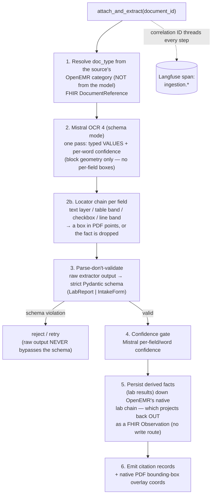
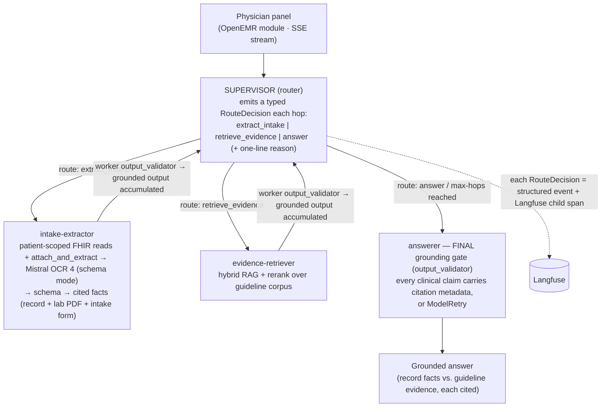

# Week 2 Architecture — AgentForge Clinical Co-Pilot (Multimodal Evidence Agent)

**Deliverable:** [`PRD-week-2.md`](PRD-week-2.md) "Week 2 Architecture Doc." This document
explains the **Week-2 delta only** — document ingestion, the supervisor/worker graph, hybrid
RAG, the eval gate, the Week-2 data model, observability, deployment, failure modes, and
tradeoffs. It does **not** repeat the Week-1 baseline: the deployment topology, authorization
model, FHIR data-access surface, verification gate, and Week-1 failure modes are established in
[`ARCHITECTURE.md`](ARCHITECTURE.md) and are cross-referenced by section number throughout
(e.g. "see [`ARCHITECTURE.md`](ARCHITECTURE.md) §5") rather than restated. Read that document
first; this one assumes it.

Detailed decision evidence — the roads not taken — lives in `/context/`:
[`agent-framework-week2.md`](context/decisions/agent-framework-week2.md) (Pydantic AI multi-agent),
[`vector-db-week2.md`](context/decisions/vector-db-week2.md) (Qdrant + Cohere), and the
[architecture-defense deck](context/planning/w2-arch-defense-deck.md). This document is the
source of truth; those back it.

A rendered, theme-aware companion diagram —
[`w2-system-diagram.html`](context/planning/w2-system-diagram.html) — visualizes both the deployed
Railway topology (verified against production) and the runtime agent graph (supervisor routing, the
two workers and their tools, the grounding gate, and where write-back leaves the read-only agent).
Open it in a browser; it does not render inline on GitHub.

> **Notation.** Acronyms are expanded on first use: **VLM** (Vision-Language Model), **RAG**
> (Retrieval-Augmented Generation), **RRF** (Reciprocal Rank Fusion), **BM25** (a sparse
> lexical ranking function), **PHI** (Protected Health Information), **IDOR** (Insecure Direct
> Object Reference), **FSM** (Finite-State Machine), **RPO/RTO** (Recovery Point / Time
> Objective), **SSE** (Server-Sent Events).

---

## 1. One-page summary

**What Week 2 adds.** Week 1 shipped a single conversational agent that reads *structured*
OpenEMR data over FHIR R4 and attributes every claim back to a row it actually fetched
([`ARCHITECTURE.md`](ARCHITECTURE.md) §§1, 6, 7). Week 2 teaches that agent to **see** the
documents clinicians actually receive — a scanned **lab PDF** and a front-desk **intake form** —
and to **route** that new work across a small multi-agent graph without losing grounding. Three
new capabilities, each a controlled expansion of a Week-1 seam rather than a replacement:

1. **Document ingestion.** A new `attach_and_extract(document_id)` tool reads a document already
   stored in OpenEMR as a `DocumentReference`, runs **Mistral OCR 4** (schema mode — typed fields +
   per-word confidence in one pass) over it, locates each value on the page, and validates the
   output against a **strict Pydantic schema** (the canonical contract — raw extractor output never
   bypasses it). Every extracted fact carries a citation back to the source (§3).
2. **Supervisor + two workers.** The Week-1 single-agent verdict was pre-registered as
   *conditional*: [`ARCHITECTURE.md`](ARCHITECTURE.md) §6.1 named the exact tripwires that would
   flip it to multi-agent. Week 2 fires tripwire #3. We add a **supervisor** that routes to an
   **intake-extractor** worker and an **evidence-retriever** worker, with logged, inspectable
   handoffs (§4).
3. **Hybrid RAG with rerank.** A small clinical-guideline corpus, indexed in **Qdrant** with
   hybrid (dense + sparse, RRF-fused) retrieval and **Cohere** reranking, so answers separate
   patient-record facts from guideline evidence, each cited (§5).

**Decided stack at a glance** (Week-1 picks carry over unchanged — see
[`ARCHITECTURE.md`](ARCHITECTURE.md) §1):

| Concern | Week-2 decision | Evidence |
|---|---|---|
| Orchestration | **Pydantic AI** multi-agent (a router/supervisor agent emits a typed route each hop; plain Python dispatches the worker and loops) — *not* LangGraph | [`agent-framework-week2.md`](context/decisions/agent-framework-week2.md) |
| Document extraction | **Mistral OCR 4** (schema mode — typed values + per-word confidence, one pass; **no per-field boxes** — a locator chain places each value, §3.5) → strict Pydantic schema | §3; [`vlm-extraction-week2.md`](context/decisions/vlm-extraction-week2.md) |
| Vector store | **Qdrant** (dedicated Railway service, private networking) | [`vector-db-week2.md`](context/decisions/vector-db-week2.md) |
| Hybrid retrieval | FastEmbed dense + sparse → Qdrant Universal Query API `Fusion.RRF` | [`vector-db-week2.md`](context/decisions/vector-db-week2.md) |
| Reranker | **Cohere Rerank** (`rerank-v4.0-fast`) | [`vector-db-week2.md`](context/decisions/vector-db-week2.md) |
| Eval gate | 52-case golden set · 5 boolean rubrics · **PR-blocking**, fails below an absolute rubric floor | §7 |
| Grounding | Week-1 `output_validator` + `ModelRetry` **ported to each worker + the final answer** | §4; [`ARCHITECTURE.md`](ARCHITECTURE.md) §7 |

**The through-line.** Week 2 is deliberately *narrower than the original spec* — two document
types, two workers, one regression gate — because the whole exercise is a test of whether the
architecture stays comprehensible while gaining multimodal input. Every addition reuses a Week-1
seam: the grounding gate becomes the per-worker citation enforcer, the correlation ID threads the
new spans, and the eval harness hardens into a hard CI gate. Nothing about Week 1 is thrown away.

---

## 2. What changed from Week 1

The single most important structural change is the move from **one agent** to a **supervisor +
two workers**. Week 1 did not pick a single agent by default — it derived the verdict bottom-up
from the use cases and *pre-registered the conditions that would reverse it*
([`ARCHITECTURE.md`](ARCHITECTURE.md) §6.1):

> Tripwires that would flip this to multi-agent: (1) UC-4 grows a per-flag adjudication step;
> (2) a UC needs branching durable state with a human-in-the-loop mid-flow; **(3) conflicting-
> source reconciliation becomes its own reasoning stage.**

**Week 2 fires tripwire #3.** The evidence-retriever is a distinct reasoning role — grounding an
answer in an external guideline corpus — that is separate from reading the patient's own record,
and separate again from extracting facts out of an uploaded document. That is three sources
(record, document, guideline) that must be reconciled into one cited answer, with a router
deciding which to consult. This is not a reversal of a Week-1 mistake; it is a **pre-planned
expansion firing on schedule**. The framework was chosen in Week 1 to be shape-neutral precisely
so this expansion would be additive.

| Dimension | Week 1 (baseline) | Week 2 (delta) |
|---|---|---|
| **Agents** | One conversational agent | Supervisor + intake-extractor + evidence-retriever |
| **Inputs** | Structured FHIR reads only (6 tools) | + unstructured lab PDF & intake form (document ingestion) |
| **Data written** | None (read-only agent) | **Still none by the agent** — it has no write surface. The sidebar posts derived facts to a session-authed module endpoint, which writes **native** OpenEMR records (the lab chain → projects out as `Observation`; `lists` for allergies/meds) + a module sidecar (§3.1) |
| **Retrieval** | None (patient record only) | Hybrid RAG over a guideline corpus (Qdrant + Cohere) |
| **Grounding gate** | One `output_validator` on the single agent's answer | Same gate **ported to each worker** + the final answer |
| **Services on Railway** | OpenEMR · agent · MySQL | + **Qdrant** service · Cohere API · document storage |
| **`/ready`** | Pings FHIR, Claude, Langfuse | + vector index & reranker; returns **degraded**, not binary |
| **Eval harness** | 7 cases, report-only, runs on promotion PRs | **52 cases, 5 boolean rubrics, PR-blocking, below-floor = fail** |
| **Correlation ID** | Threads one turn's tool loop | + ingestion, extraction call, retrieval, handoffs |
| **Tracing** | Flat spans under one turn | Per-route child spans + worker runs, all **under the chat-turn root** (flat, not under a supervisor span) |

**What did not change** (and why that matters): the deployment topology (Option D — PHP module +
standalone Python agent), the authorization model (patient-scoped SMART token minted in PHP, IDOR
unreachable through the agent), the FHIR-only data-access posture, and the verification *seam*
itself. Those are load-bearing and stable; see [`ARCHITECTURE.md`](ARCHITECTURE.md) §§3–7. Week 2
extends them; it does not touch them.

**Migration note (schema evolution).** Week 2 introduces new persisted artifacts (derived lab
results, guideline chunks, citation records) but **changes no Week-1 schema** — the six FHIR read
tools and their typed return models are untouched. The new writes are ordinary rows in OpenEMR's
existing clinical tables plus **one new module-owned table** (the extraction sidecar, installed by
the module's own SQL), so there is no Week-1→Week-2 data migration and no backwards-compatibility
break in the existing tool contracts.

---

## 3. Document ingestion flow

The new tool is `attach_and_extract(document_id)`, reading a document already filed in OpenEMR and
supporting `doc_type ∈ {lab_pdf, intake_form}`. It is the intake-extractor worker's single tool. Its
job: see the source, extract to a strict schema, and locate every fact on the page.

**The tool takes no `doc_type` argument, deliberately.** The type is resolved from the document's
own OpenEMR **category** at discovery (`Lab Report` → `lab_pdf`, `Patient Information` →
`intake_form`) and rides on the summary `list_documents` returns. The model chooses *which* document
to read, never *how* to read it — a model-supplied `doc_type` would let it pick the schema a
document is interpreted through, which is exactly the decision the category exists to make. Intake
matches its category **exactly** while labs match on a substring: `Lab Report` is a purpose-built
OpenEMR category, but `Patient Information` is the identity bucket (its children are `Patient ID
card` and `Patient Photograph`), so a loose match there would read a driver's licence through the
intake schema.

**Decided extractor: Mistral OCR 4 in schema mode**
([`vlm-extraction-week2.md`](context/decisions/vlm-extraction-week2.md)). It returns, in **one
pass**, each typed field plus **per-field / per-word confidence**. This replaces the previous plan of
Claude vision + a separate OCR pass: there is **no separate OCR step on the critical path**. The
choice is driven by Core Req 5's
pixel-accurate overlay requirement — Claude vision is the wrong tool for it (its Citations API
grounds to **page/section, not pixels**, and citations are **incompatible with structured output**,
returning 400). The
extractor's raw output is still **untrusted until validated into the strict Pydantic schema** (the
schema is the boundary), and the `output_validator` grounding gate still refuses any fact that
doesn't resolve to a source span. Mistral is a **managed external API** (like Cohere Rerank; §10),
wired into the same client/tracing surface. A possible fallback to revisit only if intake evals
regress is Claude vision for the reasoning-heavy free-text fields (§12) — not built now.

**Correction (JOS-80, verified against the live API): Mistral does NOT return a per-field bounding
box.** It returns the field VALUES plus whole-**block** geometry (a table's box, not a cell's), so
the "geometry-native, one-pass, no string-alignment" premise above holds only for the values — not
for the boxes. Where each value SITS is resolved separately, by a **locator chain** bound to that
field (§3.5). This is the single biggest gap between the original decision and what shipped; the
decision to use Mistral still stands (its values and confidence are good, and the locators are
deterministic code rather than a model), but the overlay is earned by our geometry layer, not by the
extractor.

Two further probe rules were learned the same way, and both are load-bearing:

- **Every probe field must be REQUIRED** (nullable, never defaulted). The SDK's schema generator
  omits a defaulted field from the JSON Schema's `required` list, and Mistral then silently drops it
  from `document_annotation` — this cost **six of nine intake fields**, and looked for weeks like a
  stale fixture rather than an API behaviour.

  > **It recurred, so it is now enforced rather than documented (JOS-87/88).** Writing the rule
  > here did not stop `_LabResultProbe` from asking for seven fields and requiring two. Adding a
  > seventh (`loinc`) tipped Mistral into dropping the rest: `unit` fell from 27 of 28 rows to
  > **0**, `collection_date` 28 → **0**, and `reference_range` 28 → 21 — losing it on exactly the
  > seven **abnormal** rows, i.e. the lab table kept rendering but without the unit and range that
  > are what prove a value is abnormal. The failure is silent by construction: an omitted key is
  > indistinguishable from a document that never printed the value. `tests/test_probe_schemas.py`
  > now asserts the `required` list of **every** probe, so the next `default=None` fails CI instead
  > of quietly deleting a column.
- **Values must be demanded verbatim** — *when the value is located on the page.* Asked plainly,
  Mistral normalizes (`03 / 14 / 1979` → `1979-03-14`). A normalized value cannot be found in the
  page's text, so it earns no box and the fact is correctly dropped rather than boxed wrongly — but
  the field is lost. Every **locatable** probe field says "exactly as printed".

  > **The exception proves the rule's purpose.** Verbatim serves *locatability*, so a field that is
  > never located does not want it. `collection_date` is parsed into a `date` and carries no box;
  > demanding it verbatim only welded the parser to the page's print format — the lab fixture prints
  > `2026-07-08 09:40`, which the ISO parser rejected outright, silently zeroing all 28 dates. It
  > asks for an ISO date instead, and `_parse_date` takes the leading date while still refusing
  > non-ISO input rather than guessing.

### 3.1 The flow



1. **Store the source first.** The uploaded file is written to OpenEMR as a FHIR
   `DocumentReference` *before* any extraction. This is the authoritative, immutable copy — the
   thing every citation ultimately points at (§6). Storing first means an extraction failure
   never loses the document.
2. **Extraction pass (one call).** **Mistral OCR 4 in schema mode** reads the page(s) and returns,
   in a single pass, each typed field with its **native pixel bounding box + page** and a
   **per-field / per-word confidence**. The extractor is given the target schema so its output is
   shaped, but its output is treated as **untrusted** until step 3. No separate OCR pass and no
   quote↔token match are needed — the geometry is native.
   - **Where the bytes come from.** The document's bytes are fetched from OpenEMR over FHIR
     `Binary` (`GET /Binary/{document_id}`) on the request's own patient-scoped SMART token
     (`patient/Binary.read`), keyed on the same `DocumentReference` UUID the citation + click-to-source
     viewer use. This required an OpenEMR-core fix so a patient-scoped request authorizes documents by
     patient ownership (`can_patient_access`) rather than the clinician category ACL (`can_access`),
     which also unblocks `DocumentReference` discovery of Documents-tab uploads. Fixture/offline mode
     serves a committed PDF through the same path.
   - **LOINC codes are read off the page, never recalled.** A lab result needs a LOINC code to be
     written back: OpenEMR publishes `procedure_result.result_code` as a LOINC **unconditionally**
     (`FhirObservationLaboratoryService:255`), so a result whose code is unknown is refused rather
     than published under a fabricated one. The code is extracted like any other printed field and
     then **grounded** — accepted only if it actually appears in the document's own text evidence
     (the PDF text layer, or the OCR's parsed table cells for a scan). This is enforced in code,
     not asked for in the prompt: a model asked for a LOINC will happily supply a *real* one from
     training, which passes a checksum and is still a fabrication. The **Mod 10 check digit** is a
     second, independent gate — it catches an OCR misread on a scan, where the mangled code lands
     in the OCR text and would otherwise pass grounding. A code failing either gate is dropped to
     null while the result keeps its value and box: losing the code costs write-back, losing the
     result would cost the answer.
   - **Residual limitation — the fixture is kinder than production.** Real lab PDFs do **not**
     reliably print LOINC; many print the performing lab's internal order code instead. The fixture
     prints them because a real lab's source system genuinely holds the code, but a production
     deployment needs a terminology-mapping layer — with its own confidence handling and a
     refuse-on-miss path — for the reports that carry none.
3. **Parse, don't validate.** Raw extractor output is parsed into a strict Pydantic model
   (`LabReport` for `lab_pdf`, `IntakeForm` for `intake_form`). Per the PRD Engineering
   Requirements, **the schema is the source of truth, not what the extractor happens to return** —
   a field it invents that isn't in the schema is dropped; a required field it omits fails
   validation and triggers a bounded retry. This is the same "parse at the boundary" discipline
   Week 1 applies to FHIR reads ([`ARCHITECTURE.md`](ARCHITECTURE.md) §4).
4. **Confidence gate.** Confidence is the extractor's **native per-field / per-word signal**. A
   field returned with low confidence — or that doesn't resolve to a source span — is exactly the
   low-confidence / unsupported case: surfaced to the physician, never dropped and never presented
   as certain. It is treated as a **low-confidence refusal** by the `output_validator` gate
   (§4.3, §11), not a silent guess.
5. **Persist derived facts — down OpenEMR's native chain, not over FHIR.** There is **no FHIR or
   REST write route for `Observation`** — nor for `AllergyIntolerance`, `MedicationRequest`, or
   `Provenance`. Both surfaces are read-only, and no `.write` scope is ever constructed for them
   (`ServerScopeListEntity.php:104-120`, `:167` `// we'll ignore write for now`). So for `lab_pdf`,
   each validated lab result is written down OpenEMR's **own lab chain** —
   `procedure_order → procedure_order_code → procedure_report → procedure_result` — which then
   **projects back out** as a FHIR `Observation` (test name, value, unit, reference range,
   collection date, abnormal flag) via `ProcedureService` / `FhirObservationLaboratoryService`.
   Verified round-trip: LOINC-coded Observations with `valueQuantity`, units, and
   `status: preliminary`, idempotently.
   - **The LOINC code is read off the page, never inferred (JOS-87).**
     `FhirObservationLaboratoryService:255` stamps `system: LOINC` on `result_code`
     **unconditionally and without validation**, so a code we did not actually read would be
     published as a coded clinical assertion. The extractor therefore takes the code from the
     document's own LOINC column, carrying its own bounding box like any other fact, behind two
     complementary gates: **grounding** (the code must appear in the document's text evidence — a
     checksum alone is not grounding, since a model recalling a LOINC supplies a *real* code that
     passes one) and a **check digit** (catching OCR misreads on scans, where a mangled code does
     appear in the text). A code failing either gate is dropped; the result survives without one and
     is simply not persisted. `loinc` is optional on `LabResult` — extraction takes what the page
     offers, persistence sets its own bar.
   - **Not yet reachable from the UI.** The write path is built and tested end-to-end, but no
     sidebar action triggers it: the turn payload does not yet carry the extracted facts, so the
     browser cannot post what it never receives. Tracked with the sidebar wiring.
   - **The `procedure_order_code` row is mandatory.** `ProcedureService::search` joins
     `preport.procedure_order_seq = order_codes.procedure_order_seq` (`:210-211`) with
     `order_codes` LEFT-joined. Omit that row and the predicate compares against NULL, never
     matches, and the results **vanish from FHIR with no error** — a clean insert and zero
     Observations. It is the one failure mode that looks exactly like success, so it gets an
     explicit regression test (§8).
   - **Synthesizing an order for an unordered result is house style**, not a fiction we invent: the
     HL7 receiver does exactly this when results arrive with no matching order
     (`receive_hl7_results.inc.php:1109-1131`).
   - **Derived ≠ clinician-confirmed.** Results are written `result_status='preliminary'`, which is
     in the FHIR-valid status list (`FhirObservationLaboratoryService.php:357-364`) and so
     round-trips as `Observation.status: preliminary`.
   - **The worker does not write.** The agent returns facts as it always has; the **sidebar** POSTs
     them to a session-authenticated module endpoint (`public/persist-facts.php`) under the
     physician's own ACL, with the pid read from the session and never the URL. The worker holds
     only a patient-scoped SMART **read** token and can reach no write surface at all — the full
     evidence table is in
     [`derived-fact-write-back.md`](context/specs/derived-fact-write-back.md).
   - **Provenance is native + sidecar — and is *not* visible through FHIR.** `FhirProvenanceService`
     **synthesizes** Provenance on the fly from other resources (`:99`
     `createProvenanceForDomainResource`, `:275` `_revinclude`): there is no Provenance table and no
     write path, it has no `entity` / `derivedFrom` support, and its author is hardwired to
     `lists.user` string-matched against `users.username`. So a fact cannot be "tagged with
     provenance pointing back to the source `DocumentReference`". The real mechanism is
     `procedure_result.document_id` — the schema's **own** source-link FK to `documents.id`
     (`database.sql:10507`) — plus the extraction **sidecar** (§6), which additionally holds the
     page + pixel bbox that no OpenEMR or FHIR field can express. **The limitation, stated plainly:**
     provenance is visible to the module and to SQL, but not through FHIR. A
     `GET /fhir/AllergyIntolerance` will not show that a fact came from a document.
   - **Intake facts — allergies and medications only**, written as native `lists` records, not as
     Observations. Demographics, chief concern, and family history are extracted but deliberately
     **not persisted** — no honest destination exists for them (§6).
6. **Citations + overlay.** Every derived fact emits a citation record and, for PDFs, the
   bounding-box coordinates for the click-to-source overlay (§3.3).

### 3.2 The two schemas (canonical contracts)

Both are strict Pydantic v2 models; a source citation field is **mandatory on every extracted
fact** — a fact without a citation is a schema violation, not a warning.

- **`LabReport`** (per `lab_pdf`) — required fields include, at minimum: test name, value, unit,
  reference range, collection date, abnormal flag, and source citation.
- **`IntakeForm`** (per `intake_form`) — required fields include, at minimum: demographics, chief
  concern, current medications, allergies, family history, and source citation.

These schemas are the **canonical contract** for the ingestion boundary and are contract-tested
in CI (§7, §8). The Pydantic definitions and their validation tests are a separate PRD deliverable.

**Extracted is not the same as persisted.** `IntakeForm`'s field list is what the extractor is asked
to read off the page; it is **not** a list of write targets. Only allergies and medications have an
honest destination in OpenEMR — demographics, chief concern, and family history are returned to the
physician in the answer but written nowhere (§6). Note also that an **empty list is missing data, not
a negative finding**: an empty `allergies` means "none read from this form", never an affirmative
NKDA, so an empty section persists nothing rather than fabricating a clinical assertion.

### 3.3 The citation contract

Every clinical claim in the final answer — extracted *or* retrieved — carries machine-readable
citation metadata in one shape:

```
{ source_type, source_id, page_or_section, field_or_chunk_id, quote_or_value }
```

| Field | For an extracted document fact | For a retrieved guideline snippet | For a FHIR record claim |
|---|---|---|---|
| `source_type` | `lab_pdf` / `intake_form` | `guideline` | `fhir` |
| `source_id` | the `DocumentReference` ID | the corpus document ID | the FHIR resource type/id (e.g. `Condition/123`) |
| `page_or_section` | PDF page number | section heading | — (n/a for a record claim) |
| `field_or_chunk_id` | the schema field name | the Qdrant chunk ID | the FHIR element / field name |
| `quote_or_value` | the extracted value (verbatim) | the retrieved snippet text | the field value (verbatim) |

For `lab_pdf`, the citation additionally records the **bounding-box coordinates** on the page —
emitted **natively by Mistral OCR 4** alongside each typed field (§3, §3.1), not reconstructed by a
match step. The click-to-source UI renders a visual **bounding-box overlay** on the stored PDF —
the physician clicks a cited lab value and sees exactly where on the scan it came from. The
citation is not merely *present*, it is *locatable on the source*; a field the extractor returns
without a resolved box (or below the confidence floor) is a low-confidence refusal (§11), never a
fabricated rectangle.

**Two citation shapes, layered — not competing.** The gate-internal grounding reference and this
canonical wire contract are two **layers** of the same mechanism, not rival formats. The
**grounding reference** is gate-internal: it resolves a structured field or a verbatim quote
against the source and stamps the real value (§4.3). The **canonical `Citation`** above —
`{source_type, source_id, page_or_section, field_or_chunk_id, quote_or_value}` — is what the
click-to-source UI consumes. The final answer grounds each claim via the internal reference, then
emits the canonical `Citation` per claim: `source_type = guideline` for corpus claims,
`fhir` for record claims (the `FhirCitation` arm of the `schemas.py` discriminated union, now
produced for record claims alongside `GuidelineCitation`'s `guideline`); the `lab_pdf` /
`intake_form` document citations (with bounding boxes) come from the ingestion path (§3.1).

### 3.4 Extraction is a one-time transform — re-extraction & idempotency

Extraction is a **one-time transform, not a per-turn operation** — that is the design intent. What
ships enforces it **at the write, not at the read**: re-extraction never creates a duplicate
clinical record, but it *does* re-run the VLM. Skipping the re-run is real work and is tracked
separately as **JOS-70** (conditional extraction / OCR cache); it is an efficiency win, not a
correctness gap.

**Why the worker cannot check first.** The obvious guard — "does an extraction result already exist
for this document? then skip the VLM" — is **not reachable from the agent.** The extraction sidecar
is a module-owned table with **no FHIR resource**, and the worker is a separate service holding only
a patient-scoped SMART read token, so it has no surface to read the sidecar through. This is the same
wall that blocks writes (§3.1): the agent can neither read nor write the sidecar, so the destination
check has to live where the write does.

**What is implemented — idempotency at write time.** The module's persist endpoint checks the
destination tables before inserting:

```
sidebar POSTs facts extracted from document X to the persist endpoint:
  1. Endpoint re-reads X's stored bytes and computes content_hash SERVER-SIDE
     (never accepted from the client — the client does not compute one).
  2. Already written for (X, content_hash)? → skip the insert, keep the existing rows.
  3. Otherwise → insert the native records → upsert the sidecar (facts + page/bbox citations).
```

This is exactly what §6's "no duplicate or untraceable records" requires: **store-once**, which is a
weaker and more achievable claim than compute-once. A re-run costs a Mistral call and converges on
the same rows.

- **The key is `(document id, content hash)`**, not the id alone — and it does three jobs at once:
  **citation, idempotency, and lineage**, keyed to the same `source_id` the citation contract carries
  (§3.3). The hash is computed by the **endpoint, from the bytes OpenEMR actually stored**, so a
  client cannot claim a fact was derived from content it was not.
- **Content hash guards re-uploads.** A corrected re-upload changes the hash and is extracted as a
  **new version**; the prior facts stay traceable to the prior version, so nothing becomes
  *untraceable* (§6).
- **Why the sidecar holds the whole extraction result, not just the facts.** A persisted lab result
  carries the *value* but **not the pixel bounding box** the click-to-source overlay needs — and no
  OpenEMR or FHIR field can express one. So the full result — typed facts *plus* page/bbox citations
  — is stored as a **sidecar** (§6), letting the overlay be re-rendered from stored state rather than
  by re-running Mistral OCR 4. The module can read it; the agent cannot.
- **Concurrency.** Two turns touching an un-extracted document at once could double-write; the
  sidecar upsert is keyed on `(document_id, content_hash, fact_table, field)`, and the endpoint's
  destination check bounds the clinical rows. Low-risk at demo scale, called out so it is a decision,
  not an accident.

### 3.5 Where a value sits — the locator chain (JOS-80)

Mistral gives the field VALUES; it does not say where they are (§3.1). Every extracted fact must
still resolve to a box on the page or it cannot back the click-to-source overlay — so location is
its own layer, `copilot.ingestion.geometry`.

**The problem it solves.** The first implementation welded geometry to one layout: a lab table. The
anchor had to sit in a left-hand column, the fallback needed an OCR *table block* to band, and the
order was hardcoded. An intake form breaks all three — and not because "forms differ from tables".
One committed intake fixture contains **four idioms at once**: label:value demographics, a checkbox
for `sex`, header tables for medications and allergies, and checkbox rows for family history. The
second fixture renders the same facts with **zero tables and zero checkboxes**. So the axis is not
document type; it is the FIELD.

**The shape.** A `ValueLocator` is one strategy for placing a value. Each field binds an ordered,
layout-agnostic `LocatorChain`; the first locator that applies wins:

| Locator | Places a value by |
|---|---|
| `RowSpanLocator` | its row's left-column anchor (the lab table join) |
| `LabelSpanLocator` | a printed label, `RIGHT` **then** `BELOW` — forms disagree about which |
| `SectionSpanLocator` | a section heading scoping the search (free text, em-dash lists) |
| `CheckboxLocator` | a marked box — and it can REFUTE (below) |
| `TableRowBandLocator` | banding an OCR table block by row count (scans) |
| `LineBandLocator` | the value's text line (coarse form fallback) |
| `PageBoxLocator` | the page, honestly labelled `PAGE` |

Two properties make the chain work rather than merely compile:

- **A box declares what it is.** `BoxPrecision` (`EXACT` / `ROW_BAND` / `LINE_BAND` / `PAGE`) plus a
  per-doc-type **floor**. "Has a box" is not "is click-to-source": the lab path could previously
  satisfy its box requirement with a whole-page rectangle. Intake's floor is `LINE_BAND`, so a fact
  that can only be placed "somewhere on page 1" is dropped rather than cited with a useless
  highlight.
- **A locator can say NO.** `LocateOutcome` is three-valued: `LOCATED`, `NOT_APPLICABLE` (wrong
  layout — try the next locator), and **`REFUTED`** (I own this field and the page contradicts the
  value — stop the chain). See §3.6.

**The scalability seam is data, not code.** A `FieldSpec` carries a `frozenset` of **label
aliases**, because the same field is introduced differently per form (`Patient Name (Last, First)`
vs `Full Name:`; `Home Address` vs `Address:`). Supporting another form's wording is one line in a
set. Only a genuinely new *idiom* warrants a new locator, which then composes into existing chains.
The two disjoint fixtures are the anti-overfit test: **one spec set must extract both**, and a
locator set tuned to either returns nothing on the other.

### 3.6 The checkbox hazard — why a box can be worse than no box

A form **preprints every option it offers**. "Male" and "Female" both sit on the page; a
family-history checklist prints "Cancer" whether or not the patient claims it. Only the tick asserts
an answer.

That breaks an assumption the citation contract quietly rests on. The contract asks that
`quote_or_value` appear **exactly as printed on the source page** — and for a fabricated
`family_history: cancer`, it *does*. A text-matching locator finds the word, boxes it, and returns a
citation that resolves. The grounding gate passes it. The physician clicks through and the highlight
lands on **real ink**. The hallucination is not caught by the overlay; it is **laundered** by it.

Verified on the committed fixture: `Female` is a bare word at x0=492.3 beside an **unticked** box.
(`Male` escapes only because the text layer merged the tick into the token `✕Male` — a kerning
accident, not a safety property.)

The defence has three parts:

1. **Checkboxes are extracted from the page's rects, not its words** — an unticked box is a border
   with no text, invisible to a word-level view. A box is ticked when a mark glyph's centre falls
   inside it (containment, so the `X` in "TX 78745" is not a tick).
2. **`REFUTED` stops the chain.** Returning "no box" is not enough: the chain would fall through to
   a coarser locator, which would match the preprinted text and hand back a box anyway.
3. **Evidence is a property of the BOX, never of the field.** `BoxEvidence` is `PRINTED_VALUE` or
   `CHECKED_MARK`. It is tempting to declare "`sex` requires a tick" — but the second fixture states
   `Sex: Male` as plain text, so that rule would make the field permanently unextractable there.
   Where boxes exist the checkbox locator owns the field and refuses; where they don't it defers.

A refused fact is never recorded, so the model cannot cite it, so the gate rejects the claim as
ungrounded. Enforcement is at map time; the gate is the backstop, not the mechanism.

---

## 4. Worker graph — supervisor + two workers

### 4.1 Shape



The supervisor is a **procedural router loop**, not tool-delegation. A dedicated
**router/supervisor agent** emits a typed **`RouteDecision`** each hop — a closed enum of three
routes (`extract_intake`, `retrieve_evidence`, `answer`) plus a one-line reason. Plain Python then
dispatches the chosen worker (intake-extractor or evidence-retriever), accumulates its grounded
output, and loops — re-invoking the router with the accumulated state — until the router decides
`answer` or a **max-hops ceiling** is hit (at which point it composes an answer anyway rather than
looping). The flow is shallow and near-linear — the PRD's own word is *small graph* — which is
exactly why a full `StateGraph` (LangGraph) is machinery we would pay for now and grow into
later ([`agent-framework-week2.md`](context/decisions/agent-framework-week2.md)). The workers
are:

- **intake-extractor** — owns the **full patient-scoped FHIR read toolset** (demographics,
  problems, medications, allergies, encounters, and free-text encounter notes) **plus**
  `attach_and_extract` (§3). It therefore **fully subsumes the Week-1 single agent**, which has
  been **removed from the request path** — the supervisor graph is now the **only** `/chat`
  behavior. Turns an uploaded document, or the patient's own record, into schema-valid, cited facts.
- **evidence-retriever** — owns the hybrid RAG tool (§5). Turns a clinical question into ranked,
  cited guideline snippets.

### 4.2 Inspectable, logged handoffs

The single biggest risk of picking Pydantic AI over LangGraph is that its routing is *procedural
Python* rather than a rendered graph object, so a grader who equates "inspectable routing" with
"a labeled-edge diagram" could read a procedural router loop as less inspectable
([`agent-framework-week2.md`](context/decisions/agent-framework-week2.md), "single biggest
risk"). We answer that by making routing legible **in the trace**:

- **Structured route events.** Every hop's routing decision is a typed **`RouteDecision`** — the
  chosen route (`extract_intake` / `retrieve_evidence` / `answer`) plus a one-line reason — logged
  as a structured event with its correlation ID. The PRD requires that handoffs be "logged and
  explainable" — this is that log.
- **Langfuse child spans.** Each **route decision** is a **child span under the chat-turn root**,
  and the worker it dispatches is a **sibling instrumented run under the same root** — a flat
  shape, not nested under a separate supervisor span (§9) — so the full hand-off chain is
  reconstructable from the correlation ID alone. The routing is inspectable in the trace even
  though it is expressed in code.
- **Escalation path.** If routing later needs an explicit, diagrammable FSM, `pydantic-graph`
  gives one *inside the same framework* — no cross-framework migration
  ([`agent-framework-week2.md`](context/decisions/agent-framework-week2.md)).

### 4.3 Grounding gate ported to the workers

Week 1's crown-jewel verification seam — `@agent.output_validator` + `ModelRetry`
([`ARCHITECTURE.md`](ARCHITECTURE.md) §7) — is a *per-agent* pre-return hook. Because it survives
the framework unchanged, we attach it in **three** places rather than one — all three backed by
**one shared citation-resolver abstraction** (resolve a claim against its source, or refuse):

1. **On the intake-extractor** — a **FHIR fetch-log resolver** for record claims: reject any
   record claim that doesn't resolve to a logged FHIR fetch, and any extracted document fact that
   doesn't resolve to a source span (a native bbox + page from Mistral OCR 4, above the confidence
   floor; the schema + citation + extractor geometry enforce this together; §3). This is the
   "vision extraction without invention" mandate, mechanically enforced.
2. **On the evidence-retriever** — a **guideline chunk-registry resolver**: reject an evidence
   claim without chunk metadata (`source_id` / `chunk_id`) resolvable in the corpus registry.
3. **On the final answer** — a **composite of both resolvers**: reject any clinical claim lacking
   the full citation shape (§3.3), exactly as Week 1 did for the single agent.

**One seam, reused three times, not rebuilt** — a single citation-resolver abstraction with a
FHIR-fetch-log implementation for record claims, a chunk-registry implementation for evidence
claims, and a composite of the two for the final answer. This is the mechanical enforcement of the
Week-2 citation contract and the `citation_present` / `factually_consistent` eval rubrics (§7).
Failure direction remains **refusal, not silent pass**: an unattributable answer degrades to "the
record doesn't support that" rather than shipping ([`ARCHITECTURE.md`](ARCHITECTURE.md) §7).

---

## 5. RAG design

**The corpus is small and static** — a curated set of clinical-guideline chunks the office
follows, each carrying source metadata. Raw scale is not the deciding axis; native hybrid
quality, Railway footprint, and metadata filtering are
([`vector-db-week2.md`](context/decisions/vector-db-week2.md)).

**Curation & chunking.** The corpus is built in-repo by the `corpus-curation` workflow
(`.claude/workflows/`, agent chain `guideline-researcher → corpus-chunker → citation-verifier`): the
researcher sources one publicly-fetchable authoritative guideline per topic and extracts short
verbatim quotes with section provenance; the chunker turns **one statement into one self-contained
chunk** (layout-aware — a criterion is never split mid-thought, unrelated statements never merged),
writing one JSON object per line to `agent/src/copilot/rag/corpus/<topic>.jsonl`; the verifier
adversarially checks each chunk against its cited source and prunes any that fail. The corpus is
**reproducible from the repo alone** (§11) — the Qdrant index is a rebuildable artifact, not the
source of truth.

Each chunk carries `{chunk_id, guideline, source, source_url, section, date, text, anchor_quote}`.
`text` is what gets embedded and cited — the verbatim quote plus a short framing clause so it reads
standalone. `anchor_quote` is a **verbatim source span** (the longest substring the chunk shares with
its fetched source, backfilled by `scripts/backfill_corpus_anchors.py` as the workflow's final step);
the sidebar turns it into a URL **text fragment** so a citation's "View source" deep-links to the exact
passage in the source PDF/page instead of opening at page 1 (JOS-85). It is optional — a source that
blocks the fetch keeps no anchor and falls back to a plain link.

**The evidence-retriever model sees only `{chunk_id, text}`, never the rest.** `search_guidelines`
records the full snippet server-side (for grounding and for the serializer to stamp provenance) but
returns a trimmed `RetrievedGuideline` view to the model. This is deliberate: the model quotes from
`text`, and the grounding gate checks the quote against `text`, so those must be the only text the
model can reach. Exposing `anchor_quote` — a *verbatim source span* that differs from the (reworded)
`text` — invited the model to copy it into a claim quote that then could never ground, failing the
turn into a refusal (JOS-89). Withholding it makes that mismatch unrepresentable rather than merely
caught by the gate's case/whitespace normalization.

### 5.1 The pipeline

```
Guideline corpus (curated chunks · Qdrant payload = full chunk; filterable: guideline, source, section)
   │  FastEmbed inside qdrant-client: dense embed + sparse (bm25 / minicoil)
   ▼
Qdrant  (dedicated Railway service · private networking)
   │  Universal Query API: prefetch(dense) + prefetch(sparse) → Fusion.RRF → top-k
   ▼
Cohere Rerank  (rerank-v4.0-fast)  → relevance floor τ, then top-K survivors
   ▼
Answer model  ← receives ONLY the surviving evidence + source metadata
   ▼
output_validator gate — no unattributable evidence claim ships
```

**Relevance gate (τ-floor + top-K, JOS-53/#31).** After rerank, a snippet ships only if it both
clears the relevance floor **τ = 0.5** *and* ranks in the **top K = 3** — i.e. the highest-scoring
survivors minus any below τ (`_above_floor` on the top-K, `retriever.py`). Two outcomes: ≥1 survivor
→ a **grounded** answer with cited evidence cards; **nothing clears τ → no evidence section**, and
the answer is composed without guideline grounding rather than fabricating it. `rerank_score` is
Cohere relevance in [0,1] (live) / normalized term-overlap (fixture) — same shape, same gate. τ is a
pragmatic floor, not a calibrated probability; τ/K are `config.py` values (`retrieval_relevance_floor`,
`rerank_top_n`), tuned on the eval set. Full contract:
[`evidence-gating-and-presentation.md`](context/specs/evidence-gating-and-presentation.md).

Each choice traces to a requirement
([`vector-db-week2.md`](context/decisions/vector-db-week2.md)):

- **Native hybrid in one API call.** PRD Core Req 3 asks literally for "sparse+dense search,
  rerank." Qdrant's Universal Query API prefetches a dense vector (semantic) and a sparse vector
  (lexical) and fuses them with **`Fusion.RRF`**. RRF is **rank-based**, so it sidesteps the
  score-scale mismatch between bounded cosine similarity and unbounded BM25 — there is **no alpha
  weight to tune or defend**. This is the seam a grader will poke, and it is a documented feature,
  not glue code.
- **One added service, not two.** FastEmbed ships inside `qdrant-client` and generates *both* the
  dense and sparse vectors in-process — no separate embedding service, no separate sparse encoder.
  The whole retrieval stack is one new Railway service plus a library, and it yields a **real
  `/ready` vector-index dependency** (§10) that an in-process store can't offer.
- **Metadata filtering.** Qdrant payload filters scope retrieval by `guideline` / `source` /
  `section`, which is also what populates the citation contract's `source_id` / `page_or_section`
  (§3.3).
- **Reranker.** Cohere `rerank-v4.0-fast` — the PRD-named default, ~$2/1k searches (rounding error
  on a small corpus), pinned to a v4.0 model (`rerank-3.5` is deprecated). Config-level swap to
  Voyage or Jina if the latency report puts rerank on the critical path.

**Implementation status (JOS-53).** The pipeline above is built in `agent/src/copilot/rag/`
(`retriever.py` hybrid+rerank, `index.py` content-correct indexer, `corpus.py`, `models.py`),
with the concrete choices: dense `BAAI/bge-small-en-v1.5` (384-dim), sparse `Qdrant/bm25`
(IDF), `prefetch_k=20`, `rerank_top_n=3` (τ-floor 0.5). Retrieved snippets carry the §3.3 `guideline`
citation arm; `/ready` now probes Qdrant (`/readyz`) and Cohere (§10). Design contract:
[`context/specs/hybrid-rag-pipeline.md`](context/specs/hybrid-rag-pipeline.md). The retriever
began as a standalone capability this increment; **the JOS-56 supervisor/worker graph** (§4) that
weaves evidence into the final answer and the `output_validator` gate shown above is **now
built** — it consumes this retriever and enforces the evidence guardrail at the worker level.

### 5.2 The sophistication ladder — where we stopped, and why

The governing principle is **match solution complexity to problem complexity** — do not default
to the fanciest RAG ([`vector-db-week2.md`](context/decisions/vector-db-week2.md), citing
Gallant). The ladder, with where we sit:

| Rung | Us |
|---|---|
| Naive vector search | baseline |
| Metadata filtering (scope to guideline / source / section) | ✓ |
| Hybrid: dense + sparse (BM25), RRF-fused | ✓ |
| Rerank the fused candidates (Cohere) | ✓ |
| Query rewriting / multi-hop | **defer** — PRD-optional; add only if evals show misses |
| Graph RAG (entity-relationship knowledge graph) | **not needed** — small, flat corpus |
| Agentic RAG (supervisor routes to retrieval tools) | ✓ — earned from the multi-agent decision |

We land on **hybrid + metadata + rerank, exposed as tools the supervisor routes to** — and that
routing *is* the Agentic-RAG rung, earned from the §4 decision rather than bolted on. We stop
short of Graph RAG and multi-hop **on purpose**: their cost, latency, and non-determinism buy
nothing on a few-hundred-chunk flat corpus.

> **Runtime modes.** The §5.1 pipeline runs as built in **`QDRANT` mode** (the deployed default):
> the live Qdrant + Cohere hybrid retriever grounds the evidence-retriever. A **`FIXTURE` mode**
> runs an in-process keyword retriever over the same real in-repo corpus (55 chunks) — no network,
> no Docker — for tests and offline dev, mirroring `FhirClientMode.FIXTURE`. Both satisfy the one
> `EvidenceRetriever` interface, so the supervisor graph is identical in either mode; `/ready`
> surfaces a degraded Qdrant/Cohere dependency and the service falls back to the fixture retriever
> rather than failing to answer.

> **Terminology guard.** "Graph" in this project means the **agent orchestration graph**
> (supervisor → workers, §4) — **not** Graph RAG (a knowledge graph over entities). Our retrieval
> is hybrid vector+lexical, not entity-graph. The two uses of "graph" are unrelated.

---

## 6. Data model & authority

Week 2 introduces five artifact types. Each has exactly **one source of truth**, explicit
lineage, defined access control, and validation rules — **no silent overwrites** (PRD Engineering
Requirements, "data authority must be explicit").

| Artifact | Authoritative owner | Lineage (where it came from) | Access | Validation |
|---|---|---|---|---|
| **Extracted lab observations** | OpenEMR — the native `procedure_order → order_code → report → result` chain, which projects out as FHIR `Observation` (there is no Observation write route, §3.1) | Derived from a stored `DocumentReference` via Mistral OCR 4 extraction; linked by `procedure_result.document_id` (native FK to `documents.id`) + the sidecar — **not** a FHIR Provenance tag | Written via a session-authed module endpoint under the physician's ACL; read via the same patient-scoped SMART read as all FHIR data ([`ARCHITECTURE.md`](ARCHITECTURE.md) §5) | `LabReport` schema; abnormal-flag + reference-range sanity checks; written `result_status='preliminary'` |
| **Intake facts** | OpenEMR — **allergies and medications only** (`lists` / `lists_medication`). Demographics, chief concern, and family history are **not persisted** — see below | Derived from a stored `DocumentReference` via extraction; linked through the sidecar (`lists` has no document FK) | Same session-authed write / patient-scoped read | `IntakeForm` schema; allergy `verification='unconfirmed'`, medication `request_intent='proposal'` |
| **Guideline chunks** | The **versioned corpus in the repo** (indexed into Qdrant) | Curated from published guidelines; reproducible from the repo alone (§11) | Non-PHI; read by the evidence-retriever | Chunk must carry `{chunk_id, guideline, source, source_url, section, date, text, anchor_quote}` (anchor_quote optional) |
| **Citation records** | The agent (emitted per claim) | Composed from an extraction or a retrieval result; for `lab_pdf`, the page + pixel bbox are **native output of Mistral OCR 4**, not a reconstructed rectangle | Rides with the answer payload | Must satisfy the full citation shape (§3.3); a `lab_pdf` citation whose field lacks a resolved bbox is refused, not shipped with a fabricated box |
| **Extraction-result cache (sidecar)** | Derived cache — **rebuildable**, not a system of record | One extraction pass over a stored source document; keyed to `(document id, content hash)` (§3.4) | Same patient scope as the source document it derives from | Holds the validated facts + page/bbox citations; superseded when the source version (hash) changes |

**Qdrant is authoritative for nothing patient-specific** — it holds only the non-PHI guideline
corpus, and that corpus is reproducible from the repo, so Qdrant is a rebuildable index, not a
system of record. **OpenEMR remains the single source of truth for all patient data**, exactly as
in Week 1.

**FHIR round-trip without duplicate or untraceable records.** The PRD requires that uploaded
documents and derived observations "round-trip through OpenEMR without creating duplicate or
untraceable records." We enforce this by:

- **Store-once.** The source document is written as exactly one `DocumentReference`; re-running
  extraction on the same document does not create a second source blob.
- **Source link — native FK + sidecar, not a FHIR Provenance tag.** A derived lab result carries
  `procedure_result.document_id`, the schema's own FK to `documents.id`, and every derived fact
  (labs and intake alike) resolves through the sidecar to document + page + bbox. So no derived
  record is *untraceable* and the chain `result → document → cited page/bbox` is always walkable —
  **but it is walkable from the module and from SQL, not over FHIR.** `FhirProvenanceService`
  synthesizes Provenance on the fly from other resources (`:99`, `:275`), has no `entity` /
  `derivedFrom` support, and hardwires its author to `lists.user`; there is no Provenance table and
  no write path. A `GET /fhir/AllergyIntolerance` therefore will not reveal that a fact came from a
  document. That is a real limitation of this fork's FHIR surface, recorded rather than glossed.
- **Idempotent derivation — check the destination at write time.** The **persist endpoint**, not the
  worker, is what guards against duplicates: it recomputes the content hash from the stored bytes and
  checks the destination tables before inserting, so re-running extraction on the same document
  converges on the same rows (§3.4). The worker cannot make this check — the sidecar has no FHIR
  resource and it holds only a read token — so re-extraction re-runs the VLM even though it never
  re-inserts. **Store-once is what the PRD requires here; compute-once is JOS-70.**
- **Where the cache lives — sidecar in OpenEMR, not a new agent datastore.** The extraction result
  (facts + page/bbox citations) is stored **alongside the source in OpenEMR**, linked to the source
  document, rather than in a database owned by the agent service. The agent deliberately holds no
  datastore of its own ([`ARCHITECTURE.md`](ARCHITECTURE.md) — FHIR-only, no DB credentials); a
  private ledger would add a second source of truth to reconcile. Keeping the sidecar in OpenEMR
  preserves **one system of record** and lets the whole per-document state (source + facts +
  citations) be recovered together (§11). The trade-off is sharper than a lookup cost: because the
  sidecar is a module table with no FHIR resource, **the agent cannot read it at all** (§3.4). It is
  the module's store, and the price of not giving the agent a datastore of its own.

**What "derived, not confirmed" looks like per fact — and why the markers are not symmetric.** Every
persisted fact carries a not-clinician-confirmed marker in OpenEMR's **own** vocabulary — no core
changes, nothing masquerading as physician-authored. What each resource can express differs, so the
markers differ in strength:

| Fact | Table | Derived marker | Reads back as | Strength |
|---|---|---|---|---|
| Labs | `procedure_result` | `result_status='preliminary'` | `Observation.status: preliminary` | Strong — verified round-trip |
| Allergies | `lists` (`type='allergy'`) | `verification='unconfirmed'` | `AllergyIntolerance.verificationStatus: unconfirmed` | Strong |
| Medications | `lists_medication` | `request_intent='proposal'` (+ `lists.comments`) | `MedicationRequest.intent: proposal` (+ `note`) | **Weaker — see below** |
| Demographics / chief concern | — | none exists | — | **Not written** |
| Family history | — | no target exists | — | **Not written** |

- **The medication marker is weaker, and that is a documented limitation.** `lists.verification` is
  **never read for a medication** — only the allergy and condition services read that column, so
  writing it on a `type='medication'` row is a silent no-op. Nor is `status` usable:
  `PrescriptionService::getBaseSQL:234-238` derives it from a `CASE` over `enddate` + `activity`
  alone, so a `lists` medication can only ever read back as `active`, `completed`, or `stopped`.
  What *is* expressible is `lists_medication.request_intent='proposal'` → `MedicationRequest.intent`
  (`PrescriptionService.php:211-212`, `FhirMedicationRequestService.php:498-507`), whose seeded
  description is a literal description of an agent-derived medication. **The honest caveat:** a
  consumer filtering on `status` sees an ordinary active medication. The signal is coded and
  spec-blessed, but weaker than the allergy path; a disclosure in `lists.comments` (surfacing as
  `MedicationRequest.note`) reinforces it.
- **Demographics and chief concern are not persisted, deliberately.** No verification concept exists
  anywhere in `PatientService` / `patient_data` / FHIR `Patient`. Writing extracted demographics
  would be an **unflagged in-place overwrite of clinician-entered chart data**, with no way for any
  reader to know it was machine-derived. There is no honest way to do it, so we do not.
- **Family history is not persisted.** No FHIR resource, no service, no structured table — nine
  fixed free-text columns (`history_data.relatives_*`). No target exists to write to.

**Consequence for PRD Core Req 1 — partially met, and stated as such.** The requirement is to
"persist derived facts as appropriate FHIR resources or OpenEMR records." Labs are persisted and
round-trip verified; allergies and medications persist by the design above; demographics, chief
concern, and family history are extracted and surfaced but **not persisted**, because no destination
exists that could mark them as derived. Full evidence:
[`derived-fact-write-back.md`](context/specs/derived-fact-write-back.md).

---

## 7. Eval gate

> **HARD GATE.** During grading, a small regression will be injected and the CI gate must fail.
> A working demo that cannot block a regression has not met the Week-2 standard (PRD).

**From Week 1 to Week 2.** Week 1 shipped 7 cases across 3 fixture patients, scored by 4
evaluators, in a **report-only** CI workflow that ran only on `qa → main` promotion PRs
([`ARCHITECTURE.md`](ARCHITECTURE.md) §11, `should_fail_on_regression: false`). Week 2 hardens
this into the gate the PRD demands:

- **52-case golden set** exercising extraction, evidence retrieval, citations, refusals, and
  missing-data behavior — including one both-tools synthesis case (`angulo-lab-ckd-nsaid`) that
  fires the vision extractor (`attach_and_extract`) and the retriever (`search_guidelines`) in a
  single turn.
- **Five boolean rubrics** (booleans, not 1–10 ratings, so failures are actionable):
  `schema_valid` · `citation_present` · `factually_consistent` · `safe_refusal` ·
  `no_phi_in_logs`.
- **PR-blocking CI job.** The suite runs on promotion PRs and **blocks the merge** if any rubric
  category **drops below its pass threshold**.

  > **On the PRD's two clauses.** The PRD requires the build to fail if a category "regresses by
  > more than 5% **or** drops below the pass threshold." We implement the second clause, as an
  > **absolute floor** — not a delta against a stored previous run. The first clause adds nothing
  > *on the gate*, and this is worth showing rather than asserting:
  >
  > - The four deterministic rubrics are floored at **1.0**, so *any* regression breaches them.
  >   There is no 5% band to ride through.
  > - `factually_consistent` is floored at **0.9**, so in principle a 1.00 → 0.92 drop (8%) would
  >   satisfy the PRD's 5% clause while clearing our floor. But the gate scores **3 cases**, so the
  >   only representable means are 1.00, 0.67, 0.33, 0.00. The smallest possible non-zero regression
  >   is **33%**, and nothing can land in the (0.9, 1.0) gap. On the CI subset the floor and the >5%
  >   rule trip on **exactly the same runs**.
  >
  > The two diverge only on the on-demand full-52 run (granularity 1/52 = 1.9%), which is an
  > iteration tool, not the gate. Floors also need no baseline state, which is what keeps the gate
  > reproducible from the repo alone (§11) rather than dependent on a prior run's numbers surviving
  > in a database — a delta rule fails open the first time that lookup breaks.

> **As-built (JOS-50).** The eval harness now runs the **supervisor graph** (§4); the Week-1 single
> agent is **deleted** (`agent.py` removed — the graph was its last consumer). The **52-case golden
> set** lives in `agent/src/copilot/evals/cases.py`, scored by the five rubrics above across the four
> fixture patients and the 8-topic guideline corpus. Every case is **falsifiable** (a plausible
> failure tied to a primary rubric — each rubric has a floor of cases that *can* fail it),
> **fixture-verified** (`verify_cases.py` + its test confirm each case's ground truth against the
> fixtures/corpus — a free, model-call-free guard, so the set cannot silently rot), **deterministic**
> (fixture FHIR + fixture retriever + fixture OCR extractor — the one case with an uploaded lab
> document replays a recorded OCR response, so extraction is exercised with no live API call), and
> **non-redundant** (unique primary-rubric × mechanism × patient × topic). **Cost discipline:** the
> CI gate runs only the **3-case subset** (`copilot-golden-ci`, ~$0.10/run); the full 52
> (`copilot-golden-v1`) is an on-demand, approval-gated run (~$2).
>
> **The gate is now enforcing.** `should_fail_on_regression: true` — a rubric below its threshold
> raises `RegressionError` and fails the promotion PR. `should_fail_on_script_error: true` as well:
> an eval that could not run has not passed, and a gate that goes green when the harness broke
> reports a safety property it never checked. The three CI cases are chosen for **route diversity,
> not convenience** — `t2dm-screening-guideline` (corpus-only retrieval), `angulo-lab-ckd-nsaid`
> (both workers: document extraction + guideline synthesis), and `angulo-labs-out-of-scope`
> (decline) — so a regression in any of the graph's three legs trips it. **Thresholds are absolute
> floors, not a delta against a previous run** (`_THRESHOLDS` in `evals/experiment.py`): the four
> deterministic rubrics sit at **1.0** — a single failure across the subset breaches one — and only
> the LLM faithfulness judge gets slack at **0.9**, because it is the one rubric a model's phrasing
> can fail without the code being wrong.

| Rubric | Boolean question it answers | Guards against |
|---|---|---|
| `schema_valid` | Did the turn's answer parse as the `ChatResponse` schema? | Malformed output bypassing the structured contract |
| `citation_present` | Does every clinical claim carry a source citation? | Uncited claims reaching the physician (§3.3) |
| `factually_consistent` | Does the summary stay within what the verified claims support? | Over-statement / subtly-wrong synthesis — Haiku faithfulness judge |
| `safe_refusal` | Did the turn answer, state absence, or decline as the case requires — without overreach? | Fabrication on missing records; definitive conclusions the record doesn't support |
| `no_phi_in_logs` | Are traces/logs/eval output free of PHI? | The disqualifying failure — PHI leaking to observability (§9) |

**Why this is the gate that matters:** graders actively try to break it. The build failing when a
rubric drops below its floor is the mechanism that makes "we prove quality with a CI gate" true
rather than aspirational. The golden set is **reproducible from the repo alone** (§11) — it does not live
only in a database with no recovery path.

---

## 8. Testing strategy

Every test is classified by layer and documented with **the failure mode it guards against** (PRD
Engineering Requirements). Integration tests run in CI **without live API access** by stubbing
LLM and Mistral OCR 4 extractor responses against fixture documents.

> **Note.** The Week-1 single agent has been **removed from the /chat request path** — the
> supervisor graph (§4) is now the only /chat behavior — and now lives only in the eval harness
> ([`ARCHITECTURE.md`](ARCHITECTURE.md) §11; graph migration tracked under **JOS-50**). The
> full ingestion→answer integration path below exercises the graph, not the retired single agent.

| Layer | What it covers | Failure mode it guards |
|---|---|---|
| **Unit** | `LabReport` / `IntakeForm` schema validators; citation-shape validator; the `attach_and_extract` tool's pure logic; **extractor-output schema-conformance + bbox-presence validation** against fixture Mistral OCR 4 responses; RRF/rerank result-shaping | A schema silently accepting a malformed or uncited extraction; a citation record missing a required field; an extracted field reaching the overlay without a native bbox / with sub-floor confidence, or such a field not being flagged as a refusal (§11) |
| **Unit** | Supervisor route-decision logic (which worker for which request) | Routing regressions — the supervisor sending extraction work to the retriever or vice versa |
| **Integration** | Full **ingestion→answer path** with fixture PDFs/form images and a **stubbed Mistral OCR 4 extractor** (fixture schema-mode responses — typed fields + native bboxes + confidence) | The store→extract→derive→cite chain breaking at a seam (e.g. a derived result losing its `document_id` / sidecar link back to the source, §6; a native bbox failing to thread into the citation record). The write-back arm is covered separately by DB-backed tests — including the **silent-vanish trap**: a chain written without `procedure_order_code` must fail loudly rather than return zero Observations (§3.1) |
| **Integration** | RAG pipeline: FastEmbed → Qdrant hybrid → Cohere rerank, against a fixture corpus | Retrieval returning wrong/empty results, or fusion/rerank silently degrading |
| **Integration** | Supervisor↔worker **contract tests** (typed handoff payloads) | A handoff payload drifting from its Pydantic contract — the interface breaking undetected |
| **Eval (golden set)** | Agent *behavior* — the 5 rubrics over 52 cases (§7) | The behavioral regressions the hard gate exists to catch |
| **CI meta** | Dependency audit + security scan on every PR; **PHI-detection check** on logs/traces/eval data | Vulnerable dependencies shipping; PHI leaking into observability (§9) |

**Not tested, and why:**

- **Live extractor / LLM / reranker accuracy** is *not* asserted in unit/integration tests — it is
  non-deterministic and would make CI flaky and network-dependent. Its quality is instead measured
  by the **golden-set evals** (§7), which is the correct instrument for probabilistic behavior.
- **OpenEMR core and the FHIR server** are not re-tested — they are upstream, covered by the
  fork's own suite, and unchanged by Week 2.
- **Qdrant/Cohere internals** are not tested — they are third-party services; we test *our*
  integration against them (with stubs in CI, live only in the eval run).
- **Framework-enforced invariants** are not re-asserted — if Pydantic guarantees a required field,
  we don't write a test proving it's required (that tests the framework, not our code).

---

## 9. Observability

Week 2 **extends** the Week-1 observability seam ([`ARCHITECTURE.md`](ARCHITECTURE.md) §10) — same
Langfuse, same correlation-ID discipline, same structured-log format. No parallel logging
convention is introduced; the Week-1 log schema gains new event types.

- **Route-decision and per-worker spans under the chat-turn root — a flat shape (as-built).**
  Each supervisor **route decision** is emitted as its own **Langfuse child span** under the
  **chat-turn root**, carrying the chosen route (`extract_intake` / `retrieve_evidence` /
  `answer`) and its one-line reason; the worker it dispatches (intake-extractor,
  evidence-retriever) is captured as a **sibling instrumented run under the same chat-turn root**
  — with the extraction and retrieval sub-calls traceable *within* their worker runs. This is an
  intended **flat** shape: route events and worker runs both hang off the chat-turn root, **not**
  nested under a separate "supervisor span" (verified live). The full hand-off chain is
  reconstructable **from the correlation ID alone** — the PRD's explicit distributed-tracing
  requirement.
- **Prompt-management syncs the answerer prompt.** Prompt-management now syncs the answerer
  prompt `copilot-answerer-prompt` (replacing the Week-1 `copilot-system-prompt`), so the graph's
  final-answer stage is versioned in Langfuse like the Week-1 single agent's system prompt was.
- **Correlation-ID propagation into the new boundaries.** The Week-1 correlation ID
  ([`ARCHITECTURE.md`](ARCHITECTURE.md) §10) now threads through **ingestion** (document
  upload/extract), **worker handoffs**, the **extraction call**, **retrieval calls**, and **FHIR writes**
  (the derived Observations). A grader reconstructs a full Week-2 request trace with the
  correlation ID and nothing else.
- **New structured events & metrics.** Document ingestion start/complete, extraction outcome
  *per field*, **Mistral OCR 4 per-field / per-word confidence per document**, **bbox-presence
  outcome per field** (native box resolved vs. missing), retrieval hit/miss, supervisor routing
  decision, worker handoff, and eval-run outcome — added to the Week-1 log schema, searchable by
  case ID / event ID / correlation ID. Dashboard gains: ingestion count & latency, extraction
  field-level pass rate, **bbox-presence rate** (the extractor-quality metric that trips the
  fallback, §12), retrieval hit rate, routing-decision breakdown, eval pass/fail per category.
- **New cost drivers, watched.** Week 2 adds a document-extraction pass (Mistral OCR 4), embedding,
  reranking, and extra inference hops. Tiered Claude routing (Haiku / Sonnet / Opus) on the agent
  side is the lever that keeps the <15s budget and the cost curve defensible
  ([`ARCHITECTURE.md`](ARCHITECTURE.md) §12) rather than flat token×N.
- **PHI-free traces — the disqualifier.** No raw document text, no patient identifiers, and no
  extracted clinical *values* reach traces, logs, eval datasets, or cost reports. This extends
  the Week-1 single de-identification seam ([`ARCHITECTURE.md`](ARCHITECTURE.md) §9) to the new
  PHI surfaces (document images and extracted fields). Document images go to Mistral OCR 4 under
  BAA for extraction (§10), but never to the observability plane: confidence *scores* and bbox
  *coordinates* are safe to trace, the underlying text and images are not. The `no_phi_in_logs`
  rubric (§7) plus a CI PHI-detection check (§8) verify it mechanically — logging PHI to a SaaS
  observability tool is the named disqualifying failure.

---

## 10. Deployment topology

Week 2 adds services to the Week-1 Railway project without changing the two-concern split (PHP
module + standalone Python agent — [`ARCHITECTURE.md`](ARCHITECTURE.md) §3). Critically, **the
agent stays one Pydantic AI service** — the supervisor and both workers run in-process; no new
agent service is spun up for the multi-agent shape.


**New on Railway:** a **Qdrant** service (one-click template, volume pre-mounted, reachable over
private networking with an API key), two **external managed APIs** — **Cohere Rerank** and
**Mistral OCR 4** (document extraction), both over HTTPS — and **document storage** (on the OpenEMR
volume, as `DocumentReference` blobs).

**Mistral OCR 4 is an external managed dependency.** Document extraction (§3) is a hosted API call,
like Cohere Rerank — not an in-process library. It adds **no new Railway service** but **is a
network dependency**, so it joins the `/ready` reachability probes below, and document images are
sent under BAA (PHI leaves the agent process for extraction, exactly as FHIR reads and inference
calls already do). **Self-hosting is the scale option**: Mistral OCR 4 can run in a single
container if volume or latency later justifies bringing it in-network — a contained change behind
the same schema boundary.

**`/ready` becomes dependency-aware — degraded, not binary.** Week 1's `/ready` pinged FHIR,
Claude, and Langfuse ([`ARCHITECTURE.md`](ARCHITECTURE.md) §10). Week 2 adds probes for **document
storage**, the **Qdrant vector index** (ping its private URL), **Cohere reranker reachability**, and
**Mistral OCR 4 extractor reachability**. `/ready` returns a **per-dependency degraded status**, not
a binary up/down: if the reranker is unreachable but Qdrant, the extractor, and FHIR are up, the
system reports *degraded* (retrieval works, reranking doesn't) rather than a blanket 503. `/health`
is unchanged — 200 if the process is alive. The two endpoints stay genuinely separate.

---

## 11. Failure modes & recovery

This section **extends** [`ARCHITECTURE.md`](ARCHITECTURE.md) §8 (Week-1 failure modes, all still
in force) with the five new Week-2 failure modes. Each entry states **how to identify it in the
logs** and **the recovery action** (PRD Engineering Requirements).

| Failure mode | How to identify in logs | Recovery action |
|---|---|---|
| **Document ingestion / storage failure** (upload or `DocumentReference` write fails/times out) | `ingestion.start` with no matching `ingestion.complete` for the correlation ID; `/ready` shows document storage degraded | Source is stored *before* extraction, so a downstream failure never loses the document; if storage itself fails the tool returns a typed error and the agent reports "couldn't save the document," never fabricates around it. |
| **Extraction schema violation** (extractor output fails `LabReport`/`IntakeForm` validation) | `schema_valid=false` on the extraction event; retry count on the extractor span | Raw output is rejected (never persisted). A bounded retry feeds the specific violation back; if still invalid, the field is surfaced as *unextracted / low-confidence* rather than guessed (§3). |
| **Document-extraction failure** (Mistral OCR 4 errors/times out, or returns only low-confidence fields) | timeout / error on the extractor span; `/ready` shows Mistral OCR 4 unreachable; per-field confidence below the floor on the extraction event | Bounded retries with explicit timeouts on the extractor call; on hard failure the tool returns a typed error and the agent reports "couldn't read the document," never guesses. A field below the confidence floor (or without a native bbox) is a **low-confidence refusal** (§3, §4.3), surfaced as unextracted rather than presented as certain. A sustained low-confidence rate on the eval bar is the documented tripwire to revisit a reasoning-VLM fallback (§12). |
| **Empty retrieval** (hybrid RAG returns no grounded evidence) | `retrieval hit=false` / zero candidates on the evidence-retriever span; retrieval-hit-rate metric drops | The evidence-retriever returns "no supporting guideline found"; the grounding gate (§4.3) blocks any evidence *claim* without a chunk citation, so the answer separates "record says X" from "no guideline evidence retrieved" rather than inventing a guideline. |
| **Supervisor routing error** (routes to the wrong worker, or loops) | The structured route event (which worker, why) diverges from the request intent; per-worker span pattern is anomalous (e.g. extractor invoked on a pure-question turn) | Routing decisions are logged as inspectable events (§4.2); a per-turn worker-invocation ceiling bounds loops (extending Week-1's tool-call ceiling, [`ARCHITECTURE.md`](ARCHITECTURE.md) §8); the contract tests (§8) catch routing regressions pre-merge. |

**Backup & recovery.** The design keeps every Week-2 artifact recoverable:

- **Guideline corpus + Qdrant index** — the corpus lives in the **repo** (versioned); the Qdrant
  index is a *rebuildable derivative*, re-indexed from the repo by a single command. **RPO for the
  index ≈ 0** (nothing unique lives only in Qdrant); **RTO** = the re-index run time (minutes on a
  small corpus).
- **Golden eval set** — lives in the repo, **reproducible from the repo alone** (PRD requirement);
  it does not depend on any database with no recovery path.
- **Stored documents + derived FHIR records** — persist on the OpenEMR volume / MySQL and inherit
  OpenEMR's backup path; derived Observations are re-derivable from the retained source
  `DocumentReference` if lost (re-run `attach_and_extract`), because the source is stored first and
  immutably (§3, §6).
- **Manual recovery** — if automated backup fails: re-index Qdrant from the repo corpus; re-run
  extraction from the retained source documents; the eval set and schemas need no recovery (they
  are the repo).

---

## 12. Risks & tradeoffs + rejected alternatives

Stated plainly, because a doc that names its own edges is the one worth trusting. These are the
verbal talking points from the architecture defense, recorded here as the risk register.

| Risk / tradeoff | The exposure | Mitigation |
|---|---|---|
| **Extraction error / hallucination** | A doc-AI extractor can mis-read field labels or overstate confidence on a scanned form | The strict schema is the contract (raw output never bypasses it, §3); every field must carry a native bbox + page above the confidence floor or it is refused (§3, §4.3); per-field/word confidence surfaces unsupported fields; `schema_valid` + `citation_present` rubrics gate it (§7) |
| **Weak semantics on free-text intake** | Mistral OCR 4 is OCR-first — strong on structured lab tables and form fields, weaker at normalizing free-text intake (units, reference ranges, abnormal-flag reasoning, free-text chief concern) than a reasoning VLM | Strict schema + `output_validator` refuse any unsupported field rather than guess; the `factually_consistent` / `schema_valid` rubrics on the **intake** cases are the tripwire. If the intake path fails the eval bar, the option to revisit is **Claude vision** for the reasoning-heavy fields, swapped in behind the same schema boundary — not built now |
| **Write-back provenance is invisible to FHIR** | A derived fact reads back over FHIR as an ordinary record: `Observation.status: preliminary` and `AllergyIntolerance.verificationStatus: unconfirmed` are strong signals, but *that the fact came from a document* is not expressible — `FhirProvenanceService` synthesizes Provenance with no `entity`/`derivedFrom` and no write path (§3.1). A `MedicationRequest` is weaker still: a consumer filtering on `status` sees an ordinary active medication (§6) | Link natively where the schema allows (`procedure_result.document_id`) and through the module-owned sidecar everywhere else, so the chain is walkable from the module and from SQL; use the strongest marker each resource *can* express, and refuse to write where **no** marker exists (demographics, chief concern, family history — §6). Recorded as a limitation rather than papered over |
| **Browser-posted facts are client-supplied** | The write is posted by the sidebar, not the worker (the worker has no write surface at all — §3.1), so a crafted request could persist facts the agent never extracted; the endpoint cannot verify them against the agent's in-memory registry | **Bounded, not eliminated:** the endpoint is session-authed and ACL-gated to a physician who can already write these records through the normal OpenEMR UI, so it is not privilege escalation; pid comes from the session and never the URL (an explicit IDOR defense), and the content hash is computed server-side from the stored bytes. Documented rather than hidden ([`derived-fact-write-back.md`](context/specs/derived-fact-write-back.md)) |
| **Silent-vanish on a missing `procedure_order_code`** | The one failure mode that looks exactly like success: omit that row and `ProcedureService`'s join predicate hits NULL, the results never match, and **zero Observations** come back from a clean insert (§3.1) | An explicit regression test asserts the chain fails loudly in our code rather than silently returning nothing (§8) |
| **Black-box supervisor** | Delegation-via-tool-call is procedural, not a rendered graph — routing could read as opaque | Every route decision is a structured, logged event + a Langfuse child span (§4.2); `pydantic-graph` is the in-framework escalation to an explicit FSM if needed |
| **Scope creep** | The pull to support five document types before two work reliably | Ship **two** document types and **two** workers first; a third doc type is explicitly PRD-*optional* extension work, not core |
| **Multi-agent latency vs. <15s** | Extra inference hops (supervisor + workers + extraction + rerank) threaten the Week-1 <15s budget ([`ARCHITECTURE.md`](ARCHITECTURE.md) §2) | Routing discipline (only consult the worker the request needs); SSE streaming to first token; tiered Claude routing keeps cost and latency defensible; RRF/rerank latency measured in the cost/latency report |
| **PHI leakage into observability** | The **disqualifying** failure — raw document text, identifiers, or extracted values reaching traces/logs/evals | Extend the single de-identification seam ([`ARCHITECTURE.md`](ARCHITECTURE.md) §9) to the new PHI surfaces; `no_phi_in_logs` rubric + CI PHI-detection check verify it mechanically (§§7–9) |

**Rejected alternatives** (brief — full reasoning in the decision docs):

- **LangGraph** (runner-up orchestration) — a reasonable multi-agent default and it owns one thing
  outright: a rendered graph object. Rejected for *this* flow because our graph is shallow and
  near-linear, and adopting it would force a **rebuild of the crown-jewel grounding gate** (it has
  no validate-then-retry primitive) plus a port of every tool to a node — spending the sprint
  porting Week-1 surface area instead of building Week-2 capability. The pick stays reversible:
  we'd switch the moment routing needs durable resumable state or human-in-the-loop mid-flow
  ([`ARCHITECTURE.md`](ARCHITECTURE.md) §6.1 tripwires #1/#2). Full analysis:
  [`agent-framework-week2.md`](context/decisions/agent-framework-week2.md).
- **Claude vision + local OCR + quote↔token match** (the previous §3 plan for document
  extraction) — extract with Claude vision, localize with a deterministic local OCR word-box pass,
  and glue them with a fuzzy quote↔token match to produce the bbox overlay. Rejected for **bbox
  fragility and three-part complexity**: the overlay rode a string-alignment heuristic on the
  critical path (a normalized value could miss its box), and it stood up an OCR pass + match layer
  purely to work around Claude's page-level-only citations. **Mistral OCR 4** returns typed fields +
  per-word confidence in one pass instead (§3; it returns no per-field box — see §3.5). Claude
  vision remains the
  **fallback to revisit only if intake evals regress** (§12 risk row above). Full analysis:
  [`vlm-extraction-week2.md`](context/decisions/vlm-extraction-week2.md).
- **pgvector** (rejected vector store) — OpenEMR runs on **MySQL, not Postgres**, so pgvector
  means standing up a *new* Postgres service **plus** a second extension for BM25 **plus**
  hand-written RRF in SQL — strictly more assembly than Qdrant for no footprint saving. It would
  only win if the project later adopted Postgres as a first-class store for other data. Full
  analysis: [`vector-db-week2.md`](context/decisions/vector-db-week2.md).
- Also considered and rejected (see decision docs): **OpenAI Agents SDK** (Claude second-class via
  LiteLLM; guardrails *halt* rather than self-correct); **LanceDB** (strong embedded runner-up —
  chosen against only because a dedicated Qdrant service yields a real `/ready` dependency);
  **Weaviate / Chroma** (heaviest footprint / least-battle-tested hybrid respectively).

---

## Decision evidence

This document is the source of truth for the Week-2 architecture. The reasoning behind each
decision — including the options not taken — is recorded in `/context/`:

- [`context/decisions/agent-framework-week2.md`](context/decisions/agent-framework-week2.md) —
  the supervisor+workers framework pick (Pydantic AI over LangGraph / OpenAI Agents SDK), with the
  full contender table and the "when I'd switch" tripwires.
- [`context/decisions/vector-db-week2.md`](context/decisions/vector-db-week2.md) — vector store,
  hybrid-retrieval strategy, and reranker (Qdrant · RRF · Cohere), with the contender tables.
- [`context/planning/w2-arch-defense-deck.md`](context/planning/w2-arch-defense-deck.md) — the
  slide-by-slide architecture defense this document expands.
- [`context/decisions/vlm-extraction-week2.md`](context/decisions/vlm-extraction-week2.md) — the
  document-extraction decision (§3): Mistral OCR 4 schema mode (typed values + per-word confidence
  in one pass) validated into the strict Pydantic schema, why Claude vision is the wrong tool for
  the pixel-bbox requirement, and the reasoning-VLM fallback if intake evals regress. Note the
  decision's "geometry-native, one-pass" premise holds for the VALUES only — Mistral returns no
  per-field box, so the boxes are earned by the locator chain (§3.5).
- [`context/specs/derived-fact-write-back.md`](context/specs/derived-fact-write-back.md) — the
  write-back design contract (§3.1, §3.4, §6): the surface-by-surface evidence that **no** write
  scope or FHIR/REST write route the agent could reach exists, why writes therefore go through a
  session-authenticated module endpoint posted by the sidebar, the per-fact marker table and why the
  markers are asymmetric, and why demographics and family history have no honest destination.
- [`ARCHITECTURE.md`](ARCHITECTURE.md) — the Week-1 baseline every section here cross-references.
