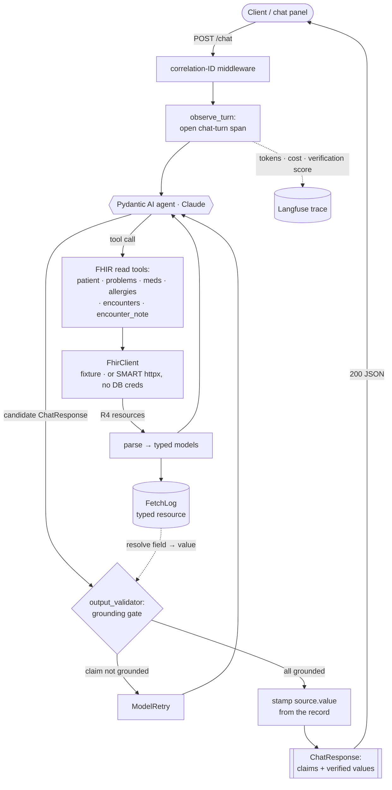

# AgentForge Clinical Co-Pilot — agent service

The standalone Python agent service from `ARCHITECTURE.md` (Option D). It grew out of a **walking
skeleton** (implementation prompt `context/execution/implementation-prompt-01-walking-skeleton.md`)
and now runs the full turn: `POST /chat` → correlation ID → FHIR tools → Claude → deterministic
verification gate → grounded structured answer with follow-ups → Langfuse trace (tokens, cost,
verification score) — plus real `/health` and `/ready` probes and a Langfuse eval harness.

Six FHIR read tools are wired — `get_patient` (`Patient`), `get_problems` (`Condition`),
`get_medications` (`MedicationRequest`, deduplicated), `get_allergies` (`AllergyIntolerance`),
`get_encounters` (`Encounter`, metadata), and `get_encounter_note` (`DocumentReference` — the
free-text clinical note for one visit, base64-decoded) — covering UC-1 orientation, UC-4
cross-referencing, and UC-3 note drill-down. Reads run under a **per-request patient-scoped token**
(the `Authorization: Bearer` header the PHP module sends; see
[Chat API contract](#chat-api-contract)), and **multi-turn conversations** are supported with
server-side history (also in the contract). Answers carry **follow-up suggestions**, and every
turn is **cost-scored** to Langfuse. The runtime verification gate grounds every claim
**deterministically**: a structured claim cites a fetched field; a note claim cites a **verbatim
quote** checked as a substring of the note text — plus domain constraints (UC-4 flags are
candidates for review, never asserted). **Faithfulness** (a Haiku 4.5 entailment judge) runs in
the **eval harness** (`src/copilot/evals/`), *not* the runtime path. SSE streaming and dynamic
model-tier routing remain follow-up increments — the service runs a single tier (Sonnet 5) per
deploy. See `context/decisions/agent-workflow.md`.

## How a turn flows

The one canonical view of the current agent workflow — kept in sync with the code as it grows.
When it needs several views (per-use-case sequences, deployment), we'll promote them to
`agent/docs/`; the system-level topology stays in the root `ARCHITECTURE.md`.



`/health` and `/ready` are orthogonal probes, not part of the turn (see below).

## Layout

```
src/copilot/
  main.py          FastAPI app, routes, middleware wiring
  config.py        pydantic-settings; all config/secrets from env (COPILOT_ prefix)
  schemas.py       ChatRequest / ChatResponse / Claim / SourceRef contracts (+ follow_ups)
  agent.py         Pydantic AI agent: six FHIR tools + deterministic output_validator gate
  verification.py  FetchLog + field-level grounding & value stamping (ARCHITECTURE.md §7)
  conversation.py  in-memory multi-turn ConversationStore (per user+patient; TTL + LRU bounded)
  pricing.py       model-tier pricing tables + per-turn cost (turn_cost_usd)
  correlation.py   X-Correlation-ID middleware
  observability.py Langfuse + Pydantic AI instrumentation; chat-turn span + verification & cost scores
  health.py        /health + /ready dependency probes
  fhir/            FhirClient protocol, httpx impl, fixture impl, PatientDemographics
  evals/           Langfuse-hosted eval dataset, cases, deterministic + Haiku-judge evaluators
tests/             deterministic tests (fixtures + FunctionModel; no live LLM/FHIR)
```

## Run locally

```bash
cd agent
python -m venv .venv && source .venv/bin/activate
pip install -e ".[dev]"
cp .env.example .env            # fixture FHIR mode works with no external services

# Serve (fixture patient id "1" is bundled):
uvicorn copilot.main:app --reload

curl localhost:8000/health
curl localhost:8000/ready       # 503 until an LLM key (and Langfuse) are configured
curl -X POST localhost:8000/chat \
  -H 'content-type: application/json' \
  -d '{"patient_id":"1","message":"Who is this patient?"}'
```

`/chat` needs `COPILOT_ANTHROPIC_API_KEY` for a live answer. Without it, run the tests — they
drive the agent with a scripted model and need no key.

## Making `/ready` green

`/ready` returns 503 until every dependency probe passes, and 200 only when all do (that is
the point — it must never return an unconditional 200). It reports each dependency's status
in the body, e.g. `{"fhir": true, "llm": false, "langfuse": false}`. The LLM and Langfuse
probes fail out of the box because no credentials are set.

> **Secrets never go in this file.** Set the variables below in your gitignored `.env`
> (locally) or as Railway service variables (prod) — `.env.example` lists them with empty
> values to copy. Do not paste real keys into the README or `.env.example`.

Credentials use their **native SDK names** (copy them straight from each vendor); the
`COPILOT_`-prefixed forms are also accepted.

| Variable | Makes green | Where to get it |
|---|---|---|
| `ANTHROPIC_API_KEY` | LLM probe (`GET api.anthropic.com/v1/models` — metadata, not a completion) | Claude Console |
| `LANGFUSE_PUBLIC_KEY` + `LANGFUSE_SECRET_KEY` | Langfuse probe (`GET {host}/api/public/health`) — **both** required, or tracing stays disabled | Langfuse → Settings → API Keys (free Hobby tier is enough) |
| `LANGFUSE_BASE_URL` | *(optional)* defaults to EU Cloud; **must match your project region** — US is `https://us.cloud.langfuse.com` | your Langfuse instance URL |

With those set in `.env`:

```bash
curl -s localhost:8000/ready | jq       # 200, every dependency "ok": true
```

The same three probes back `/ready` whether run locally or on Railway — setting these as
Railway service variables is what makes the deployed `/ready` report healthy.

## Quality gates

```bash
pytest        # deterministic; no network, no live LLM
ruff check .
mypy
```

## Chat API contract

The PHP module (built in a separate worktree) calls the agent over HTTP. The contract:

```
POST /chat
Authorization: Bearer <SMART patient/*.read token>   # minted by the module for the open patient
Content-Type: application/json

{ "patient_id": "<FHIR Patient id>",
  "message": "<the physician's question>",
  "conversation_id": "<id from a prior turn's response, or omit to start a new conversation>" }
```

- The **token travels in the `Authorization: Bearer` header**, never the body. In `http` mode the
  agent builds a FHIR client scoped to that token per request, so it can physically read only the
  one patient the token is bound to (ARCHITECTURE.md §5).
- **No token in `http` mode → `401`** before any FHIR read or LLM call. `patient_id` in the body
  must match the patient the token is scoped to (the FHIR server enforces the scope).
- **Multi-turn:** omit `conversation_id` to start a conversation; every answered turn's response
  carries a `conversation_id` the client must echo on the next turn to continue the thread. History
  is kept server-side (it contains PHI), so the client only round-trips the id. A conversation is
  bound to one patient: reusing its id with a different `patient_id` → **`403`**; an unknown or
  expired id → **`404`** (start a new conversation).
- In `fixture` mode the header is ignored (no token exists) and the bundled seed patient is served,
  so local dev needs no token.
- Response: `200` with `{summary, claims[], follow_ups[], conversation_id}` (each claim carries a
  code-stamped `source`), or a refusal / `401` / `403` / `404` / `502` per ARCHITECTURE.md §8.

## Demo without the module (fixture toggle)

`/chat` in `http` mode requires the module's SMART token, so a bare `curl`/Swagger call returns
`401` (correct). To demo the agent **standalone** — no token, no live FHIR — flip the deployed
service to fixture mode, which serves the bundled seed patient (`patient_id: "1"`, Marisol Reyes):

```bash
railway variables --set COPILOT_FHIR_CLIENT_MODE=fixture --service copilot-agent   # redeploys
# then, tokenless:
curl -X POST https://<agent-domain>/chat -H 'content-type: application/json' \
  -d '{"patient_id":"1","message":"what do you know about this patient"}'          # 200 + grounded answer
railway variables --set COPILOT_FHIR_CLIENT_MODE=http --service copilot-agent      # flip back to real FHIR
```

Fixture mode exercises the full pipeline (Claude · 6 tools · grounding gate · Langfuse trace) on
seed data; it does **not** hit live FHIR or the auth path. Default the deployed service to `http`.

## Deploy (Railway)

Same project/region as OpenEMR (internal networking). Build from this `agent/` directory using
the `Dockerfile`; set the `COPILOT_*` / native-SDK variables as Railway service variables. For live
FHIR set `COPILOT_FHIR_CLIENT_MODE=http` and `COPILOT_FHIR_BASE_URL` (the OpenEMR FHIR R4 base). The
per-patient token arrives per request via the `Authorization` header above, so **no static token is
needed in production**; `COPILOT_FHIR_BEARER_TOKEN` remains only as an optional dev fallback for
hitting live FHIR without the module.

## Roadmap: observability-driven development loop (planned)

**Goal:** close the loop between the traces this service already emits and the coding agent
that develops it — a self-correcting, trace-driven iteration cycle where Claude Code *reads the
agent's own Langfuse traces, diagnoses failures, fixes the code, re-runs, and repeats until a
defined green signal is reached*, rather than a human ferrying stack traces back and forth.

The architecture already provides the seam. Every turn carries a **correlation ID** (§10) that
ties an HTTP response → its Langfuse trace → and (soon) its eval case, so a failure is always
reproducible. The loop wires two more pieces on top:

- **Feedback channel — the Langfuse MCP server.** Add Langfuse as an MCP server so Claude Code
  can query the agent's traces directly (errors, tool failures, the `verification_grounding`
  score, latency, token cost) instead of being told about them:

  ```bash
  # US project shown; base64-encode "public_key:secret_key"
  claude mcp add --transport http langfuse \
    https://us.cloud.langfuse.com/api/public/mcp \
    --header "Authorization: Basic <base64(pk:sk)>"
  ```

- **Driver — Claude Code `/loop`.** Run the observe → diagnose → fix → re-run cycle on a
  recurring or self-paced loop until the exit signal is met.

**The cycle:** run the agent (or the eval suite) → pull the failing traces via the Langfuse MCP
tool → root-cause from the trace (Langfuse's error-analysis discipline: cluster failures into a
taxonomy before fixing, don't patch symptom-by-symptom) → apply the fix → re-run → re-check the
traces. Repeat until working fully.

**Guardrails (what keeps an autonomous loop honest, not just busy):**

- **Anchor to a measurable exit signal**, never "looks done" — e.g. eval pass-rate ≥ target,
  `verification_grounding` pass-rate ≥ target, zero tool failures, p95 latency within the <15s
  budget. The loop stops when the signal is green, not when it runs out of ideas.
- **Regression protection:** every iteration must keep the deterministic test suite *and* the
  eval suite green. A fix that greens one trace and reds another is a net loss — the suites are
  the ratchet.
- **Turn each new failure into an eval case first, then fix it** — so the loop builds a
  regression net as it goes and can't silently reintroduce a bug it already saw.
- **Bounded and gated:** cap iterations / token budget, and keep a human checkpoint for changes
  that touch contracts, the authorization gate, or anything security-relevant — an autonomous
  loop should harden the agent, not quietly rewrite its trust boundary.

**Status:** planned — pending the Langfuse MCP wiring and the `/loop` driver. The two pieces
this loop needs as its exit signal are **already in place**: the observability half (traces,
scores, correlation IDs) and the eval suite (`src/copilot/evals/`, run in CI). So the loop has
real signal to consume the moment it's turned on.
