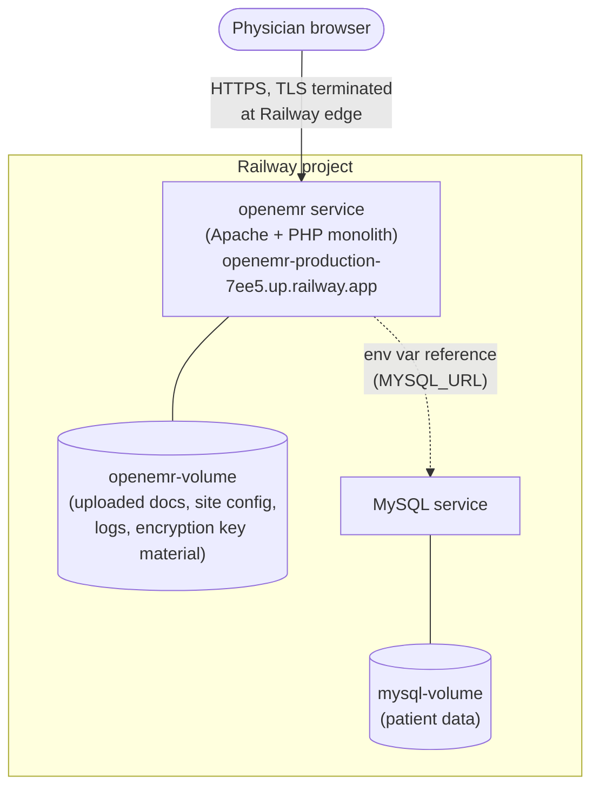
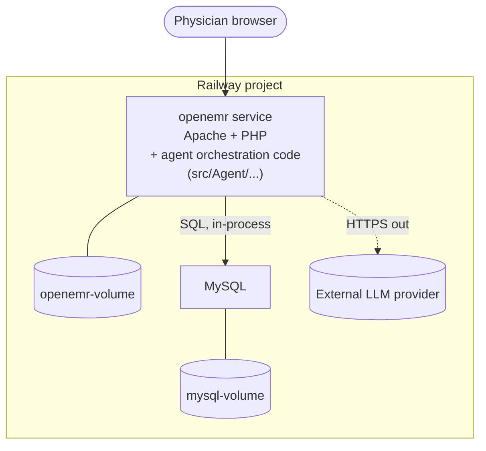
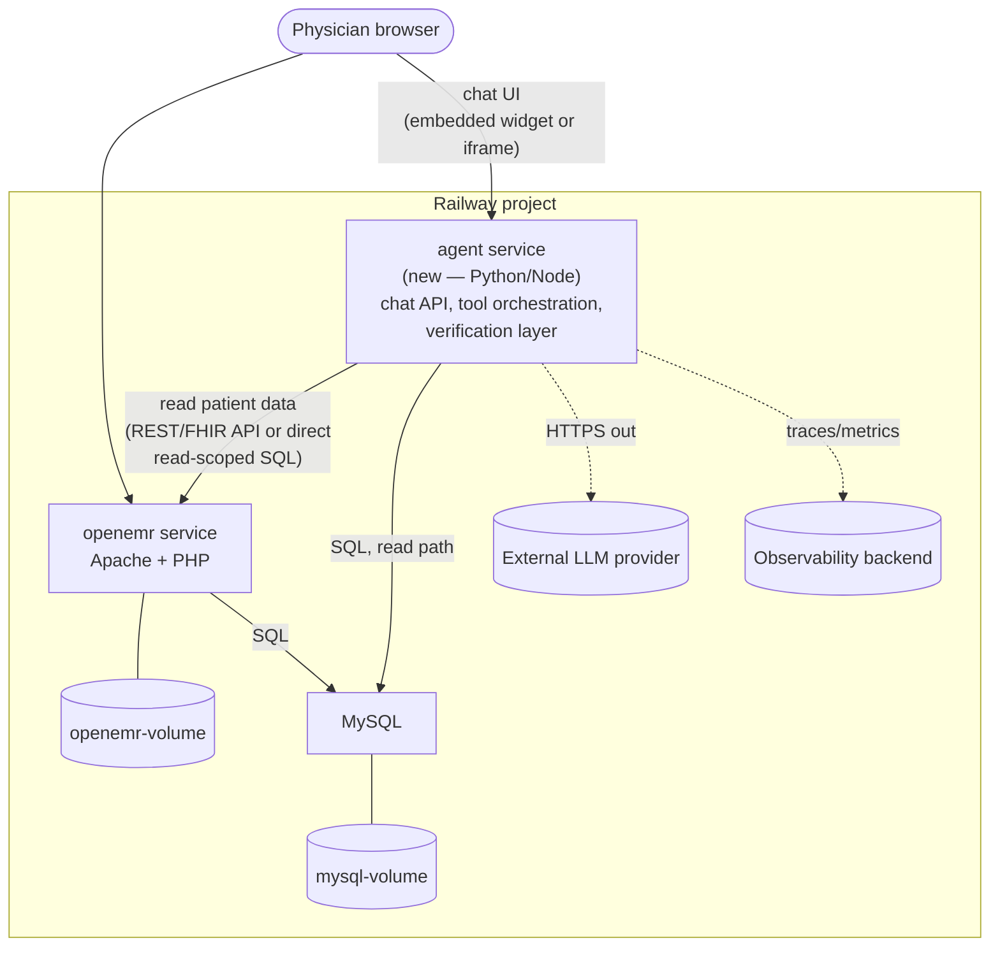
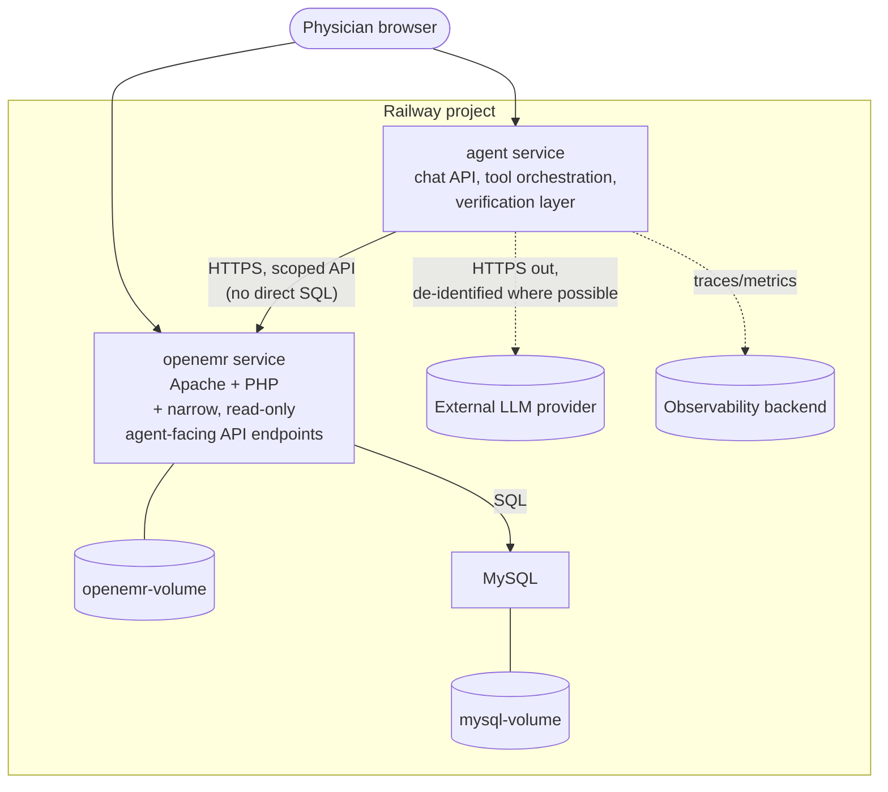
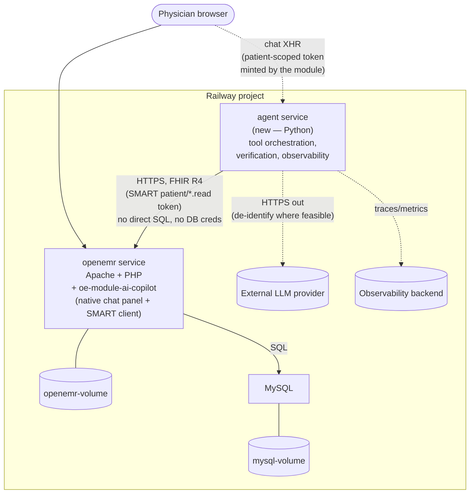

# Deployment Strategy — Stage 5 Decision Evidence

**Purpose:** Working analysis behind `../ARCHITECTURE.md` (PRD Stage 5). Documents the
current Railway deployment topology and compares options for where the Clinical
Co-Pilot's agent logic should live relative to it. This is decision evidence for the
architecture defense — not a deliverable itself. `ARCHITECTURE.md` is the source of
truth; this doc shows the road not taken and why.

**Grounding:** Constraints below are pulled from `../AUDIT.md` (security/compliance
findings) and `../USERS.md` (latency budget, authorization scenarios), not assumed.

---

## Current state (as deployed today)

Two services, both online:

- **`openemr`** — the entire application: web server, PHP business logic, and
  server-rendered templates (Twig/Smarty) in one container. There is no separate
  frontend service because OpenEMR isn't a decoupled SPA+API — see prior discussion
  in-session. `openemr-volume` persists what the app writes to disk outside the DB
  (uploaded patient documents, `sites/default/` config, crypto key material per
  `CryptoGen`, logs).
- **`MySQL`** — patient data, split out for its own persistence/lifecycle. The
  dashed arrow is Railway's dependency graph (an env var reference), not a literal
  network diagram.

**Relevant constraints from the audit (`AUDIT.md`):**

- No in-app TLS/HSTS enforcement — `.htaccess` has no forced-HTTPS redirect, no
  `Strict-Transport-Security` header, and the session cookie defaults
  `cookie_secure => false`. TLS is "the operator's responsibility" — currently
  satisfied by Railway terminating TLS at its edge, but this means **any new
  service we add must not assume the app enforces transport security for it**.
- **IDOR gap** (Insecure Direct Object Reference — an endpoint trusts a submitted
  ID without checking the requester is authorized for *that specific patient*):
  patient-level authorization is not yet closed in OpenEMR itself. `USERS.md`
  UC-5 (cross-cover cold-start) is explicitly the authorization test case the
  agent must get right — the agent's own authorization layer cannot assume the
  underlying app already enforces this correctly.
- **New PHI flow, new BAA surface.** AUDIT.md flags this explicitly:
  *"routing any PHI to an external LLM/AI provider would introduce a new outbound
  data flow requiring a signed BAA and a de-identification (§164.514) assessment
  before enablement."* Existing outbound PHI paths (FHIR export, Direct messaging,
  eRx, fax) are all in-tree and audited; an LLM call is not, and isn't automatically
  covered by "act as if a BAA exists" — that's a per-provider legal assumption, not
  a de-identification substitute.
- **Secrets hygiene.** Dev compose files have committed credentials (rotate before
  reuse); prod deployment must override all default dev/prod credentials rather
  than inherit them. Any new service's secrets go through Railway env vars, not
  baked into an image or committed compose file.

**Relevant constraint from users (`USERS.md`):** the physician "will not tolerate
... latency that outlasts the walk between two rooms" — target orientation in
**<15 seconds**, hard ceiling around 90 seconds. Whatever we add cannot introduce
an unbounded network hop chain between the user and a first useful token.

---

## Option A — Embed agent logic in the OpenEMR monolith

Agent code lives under `src/` as a new PSR-4 namespace, invoked from a new
controller/route in the existing app. No new Railway service.

**Pros:** simplest to ship; reuses existing session/auth context directly (no new
auth boundary to design); one deploy pipeline; zero new network hop, so it's the
easiest path to the <15s latency budget; no new service to secure/monitor from
scratch.

**Cons:** PHP is a workable but non-ideal fit for LLM orchestration (tool-calling
loops, streaming, retries) compared to ecosystems built around it; agent failures
(a hung LLM call, a tool timeout) share the same process/request-handling path as
core clinical workflows — a slow or wedged agent call risks degrading unrelated
OpenEMR page loads if not carefully isolated (async, timeouts, circuit breaking);
the PRD's engineering requirements (separate `/health` vs `/ready`, correlation
IDs, dashboards, alerting per-component) are harder to keep *agent-specific* when
agent code is inline in a general-purpose app process; every LLM call happens
inside the same trust boundary as all of OpenEMR, making the BAA/de-identification
boundary (the audit's flagged new-PHI-flow concern) something you have to
carve out by convention rather than by service boundary.

---

## Option B — Standalone agent service (new Railway service)

Agent logic ships as its own Railway service, in whatever language/framework fits
agent tooling best, calling back into OpenEMR/MySQL for data and out to the LLM
provider.

**Pros:** language freedom for agent-appropriate tooling; independent deploy/scale
lifecycle — an agent redeploy or a load spike doesn't touch the clinical app;
clean place to implement the PRD's engineering requirements as *this service's*
concerns specifically — its own `/health` + `/ready` (the latter actually checking
OpenEMR reachability, LLM provider reachability, and the observability backend,
not just returning 200), its own correlation-ID propagation, its own dashboards
and alert thresholds (p95 latency, error rate, tool failure rate) without mixing
those signals with unrelated OpenEMR page-load metrics; a single seam where every
outbound PHI-to-LLM call passes through one code path — the natural place to
enforce the audit's flagged de-identification/redaction step and to log exactly
what left the system's authorization boundary, which also makes the authorization
layer (closing the IDOR gap for *this specific* data path) something we design
once, deliberately, rather than inheriting OpenEMR's current gap by proximity.

**Cons:** a new service to secure, deploy, and monitor from scratch; adds a
network hop between physician and first token (mitigated by keeping the service
in the same Railway project/region — internal networking, not public internet
round-trip); duplicates some auth logic unless the agent service can validate the
same OpenEMR session/token rather than inventing a parallel login.

---

## Option C — Standalone agent service, with data access gated through an explicit API boundary (hardened variant of B)

Same as Option B, except the agent service **never talks to MySQL directly** —
every read goes through a small set of new, purpose-built OpenEMR endpoints
(canonical schemas, per the PRD's "contracts are the source of truth" engineering
requirement) that enforce authorization *in the app that already owns the patient
data model*, rather than re-implementing OpenEMR's ACL logic inside the agent
service.

**Pros:** single authorization enforcement point (OpenEMR's own ACL/session
system, which already has the role/permission model, even with the IDOR gap
still needing a fix — fixed once, benefits both the UI and the agent); the agent
service only ever sees the minimum data an endpoint chooses to return, making the
de-identification/redaction boundary sit at the point closest to the source of
truth; smaller attack surface than giving a second service direct DB credentials.

**Cons:** more upfront work — new API endpoints must be designed, versioned, and
tested before the agent can use them, which is real scope added to Stage 5/Early
Submission timelines; every new "what the agent needs to know" requires an API
change, not just a new SQL query, which is slower to iterate on during
development.

---

## Option D — Native PHP module shim + standalone agent service, FHIR-only *(selected)*

The chosen architecture. It splits the two concerns that Options A–C each got only
half-right:

- **UI + authentication live in a thin PHP module** (`oe-module-ai-copilot`), built on
  OpenEMR's verified event-driven extension path — `PatientDemographics\RenderEvent`
  mounts the chat panel natively inside the patient chart (no iframe), and the module
  acts as the SMART/OAuth client, minting a **patient-context-scoped** token for the
  patient currently open. This reuses OpenEMR's own session and login (Option A's one
  real advantage) without embedding any agent logic in PHP.
- **All agent logic lives in a standalone Python service** (Option B's process model) —
  orchestration, tool-calling, the verification layer, correlation IDs, and per-service
  `/health`+`/ready`/metrics — deployed as its own Railway service from an `/agent/`
  directory in *this same repo* (no separate git repo, no separate local checkout).
- **Data access is FHIR-only** (Option C's security discipline, but using endpoints that
  *already exist*): the agent reads exclusively through OpenEMR's FHIR R4 API under the
  patient-scoped token, and holds **no database credentials at all**. Fact-check confirmed
  OpenEMR already ships read-only FHIR endpoints for all five resources the agent needs
  (`Patient`, `Condition`, `MedicationRequest`, `AllergyIntolerance`, `Encounter`) with
  SMART `patient/*.read` scopes — so Option C's "purpose-built endpoints" are largely
  unnecessary. The one custom endpoint we may add is a single patient-snapshot call if
  per-resource FHIR round-trips threaten the <15s budget.

**Authorization model.** The patient-context token makes the IDOR gap *unreachable through
the agent* for UC-1–UC-4 — the token is bound to one patient, so the agent physically
cannot read another. UC-5 (cross-cover) is gated at the module's launch point: before
opening the copilot on a patient the user doesn't own, the module checks care-team
membership (`care_teams`/`care_team_member`) or break-the-glass group membership
(`BreakglassChecker` — keyed off a GACL group value, not a username prefix); neither →
refuse and audit. Enforcement stays at the OpenEMR boundary, not duplicated in the agent.

**Pros:** best of all three prior options — native in-EHR UX and session reuse (from A),
independent deploy/scale and a clean home for the PRD's engineering requirements (from B),
single-authorization-point and no second DB credential (from C). Every outbound
PHI-to-LLM call passes through one Python code path — the natural de-identification/
redaction and logging seam. Uses only verified extension points; zero core patches.

**Cons:** two languages and two deploy targets to run (mitigated: same repo, same Railway
project/region — internal networking). A SMART launch/token flow must be built (more than
A's implicit session, but a standard, documented pattern).

**FHIR-only does *not* hide medications** (correction to an earlier concern — verified
against code and the live seed DB). OpenEMR's FHIR `MedicationRequest` is a SQL UNION of
*both* med storage locations — `prescriptions` **and** `lists WHERE type='medication'`
(`src/Services/PrescriptionService.php:189-260`, mapped in
`src/Services/FHIR/FhirMedicationRequestService.php:210-213,458-468`). Free-text/list meds
still surface as `medicationCodeableConcept.text` (the drug name) even when they carry no
structured RxNorm code, so no medication is omitted from FHIR-only access. The residual
issues are second-order and handled in the agent's med tool, not by reaching into SQL:
- **Duplication, not omission.** A med recorded in both tables without the internal
  `prescription_id` link appears as two `MedicationRequest` resources — one RxNorm-coded,
  one text-only (present in our seed: 242/249 meds overlap). The med tool must dedup,
  keying on drug *text* (the list branch has no code to match on).
- **Coding-completeness for UC-4.** List-originated meds lack structured RxNorm, so
  med↔problem / interaction cross-referencing falls back to name/text matching rather than
  code matching. Weaker for those meds, but they remain visible and citable.

---

## Comparison

| Dimension | A — Embedded | B — Standalone service | C — Standalone + API boundary | **D — Module shim + FHIR-only (selected)** |
|---|---|---|---|---|
| Time to first working version | Fastest | Moderate | Slowest | Moderate (reuses existing FHIR API) |
| Latency risk (<15s budget) | Lowest (no hop) | Low (internal network hop) | Low (internal network hop) | Low (internal hop; snapshot endpoint if needed) |
| Authorization / IDOR exposure | Inherits OpenEMR's current gap directly | Must design its own, separately | Enforced once, in OpenEMR, reused | Patient-scoped token (agent can't reach IDOR) + care-team/breakglass gate at OpenEMR boundary |
| BAA / de-identification seam | Hard to isolate (scattered) | One seam, self-designed | One seam, backed by source-of-truth ACL | One seam (agent's single LLM-call path) |
| PRD engineering reqs (health/ready, correlation IDs, per-service dashboards) | Hard to keep agent-specific | Natural fit | Natural fit | Natural fit |
| Blast radius of an agent bug/outage | Shares OpenEMR's process | Isolated | Isolated | Isolated |
| New attack surface | None (reuses existing) | New service + DB credentials | New service, narrower (no direct DB access) | New service, **no DB credentials** (FHIR-only) |
| UI integration | Native (inline PHP) | iframe/embedded widget | iframe/embedded widget | Native (module `RenderEvent` panel) |

## Decision

**Option D is selected.** It composes the best parts of A/B/C: native in-EHR UI and
session reuse (A), an isolated standalone agent service that fits the PRD's engineering
requirements (B), and single-point authorization with no second DB credential (C) —
riding the FHIR R4 + SMART scope surface OpenEMR already ships.

The open questions that A–C left dangling are now resolved:

- **Authentication** — the module reuses OpenEMR's existing session and issues a SMART
  *patient-scoped* token; it is **not** a separate login. (Strongest authorization-
  tractability outcome from `persona-analysis.md`.)
- **Option C's endpoint work** — largely moot: OpenEMR's existing FHIR R4 + SMART
  `patient/*.read` scopes already cover the five needed resources. At most one custom
  patient-snapshot endpoint, added only if per-resource round-trips threaten the latency
  budget — a targeted optimization, not a prerequisite.
- **De-identification** — happens in the agent service's single LLM-call code path (one
  seam), flagged as a documented step in `ARCHITECTURE.md`.

Residual decision recorded here for the defense: **FHIR-only is chosen over a direct-SQL
fallback.** We verified (code + live seed DB) that this hides *no* medications — FHIR
`MedicationRequest` unions both the `prescriptions` and `lists` med sources. The accepted
tradeoffs are second-order: the agent's med tool must dedup duplicate resources and fall
back to text matching for list-originated meds that lack RxNorm codes. This is preferable
to giving the agent DB access, which would reintroduce the IDOR-reimplementation problem
for a coding-completeness issue the tool can handle itself.

`ARCHITECTURE.md` remains the source of truth; this document records *why* D beat A/B/C so
the choice is deliberate and defensible, not a foregone conclusion.
