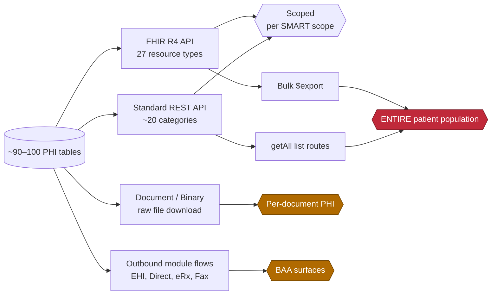

# OpenEMR Patient Data Exposure Map

**Purpose:** Every category of patient data (PHI) this platform stores, and the surfaces
through which it can leave the system — the ingestion and egress landscape an AI Clinical
Co-Pilot must reason about before it touches a single record.

**Method:** Re-derived independently (2026-07-07) via five parallel source/schema sweeps over
`sql/database.sql`, `src/Services/`, `src/FHIR/`, `src/RestControllers/`, and `apis/routes/`,
then cross-checked against `AUDIT.md`. This document maps the data *surface*; it contains no PHI.

*(PHI = Protected Health Information. Acronyms follow the glossary in `AUDIT.md`.)*

---

## At a glance

| Metric | Count |
|---|---|
| Tables in the schema | **282** |
| Tables carrying patient PHI (a `pid` link) | **~90–100** |
| FHIR resource types exposing PHI | **27** |
| Standard REST endpoint categories | **~20** |
| Whole-population egress paths | **3** |

---

## 1. Data by sensitivity tier

Ranked by the regulatory and breach risk each category carries if it reaches an AI context
window. Credentials should **never** enter one. The Critical clinical categories carry special
legal protection — 42 CFR Part 2 (the federal substance-use-disorder confidentiality rule) and
state super-confidentiality statutes — beyond baseline HIPAA.

### Critical — identifiers, protected health status, and credentials

| Category | Where it lives | Notes |
|---|---|---|
| Government identifiers | `patient_data.ss` (SSN), `drivers_license`, `DOB`, full + birth/dead name, guardian block | Plaintext `varchar`; no column-level encryption |
| Part 2 / special-protection health | `form_ros.hiv`, `history_data` (substance use, mental-health family history), `therapy_groups*`, `erx_narcotics` | Behavioral health, substance use, HIV, controlled-substance Rx |
| Reproductive / sexual health & SOGI | `patient_data.sexual_orientation`, `gender_identity`, `history_data` exam dates, `contrastart` | Contraception, gyn/breast/prostate exam history |
| Auth credentials | `patient_access_onsite.portal_pwd`, `users_secure.password*`, `login_mfa_registrations` | Password hashes — must be excluded from AI ingestion entirely |

### High — financial and insurance PII

| Category | Where it lives | Notes |
|---|---|---|
| Insurance / coverage | `insurance_data` | Policy & group numbers, **subscriber SSN + DOB**, subscriber name/address/employer, copay |
| Billing & payments | `billing`, `payments`, `ar_activity` | Balances, `in_collection` flags, billing notes, payment ledger |
| Payment-processor secrets | `payment_gateway_details` | Login / transaction keys. No raw card or bank number is stored — card data lives with the external gateway |

### Moderate — unstructured free-text

Lowest baseline sensitivity but the **highest ingestion risk**: these fields can silently
contain any Critical-tier item in narrative form, so they need PHI scrubbing before an LLM reads them.

| Category | Where it lives |
|---|---|
| Clinical narrative | `form_soap`, `form_clinical_notes`, `form_encounter.reason`, `lists.comments` + diagnosis titles |
| Messages & notes | `pnotes.body` (patient / portal messages), `amendments`, `form_dictation` |
| History & documents | `history_data` family/lifestyle longtext, `documents.document_data` + scanned files, generic `lbf_data` / `patient_data.usertext*` buckets |

---

## 2. The data by clinical domain

Where the data lives — the ~90–100 PHI-bearing tables grouped into the domains the service
layer (`src/Services/`) models. Each domain has a matching FHIR projection under
`src/Services/FHIR/`. **Sensitivity** flags the peak tier present in the domain.

| Domain | Representative tables | PHI exposed | Sensitivity |
|---|---|---|---|
| Identity & demographics | `patient_data`, `person`, `patient_name_history`, `employer_data` | Name, SSN, DOB, address, phone, email, race/ethnicity, religion, income, occupation, guardian | Critical |
| Contacts & related persons | `contact`, `contact_address`, `contact_telecom`, `phone_numbers` | Next-of-kin, guardians, addresses & telecoms for patient and relations | Critical |
| Insurance & billing | `insurance_data`, `insurance_numbers`, `billing`, `claims`, `payments`, `ar_activity` | Policy/group #, subscriber SSN, coverage, charges, balances, payment ledger | High |
| Encounters & notes | `form_encounter`, `forms`, `form_soap`, `form_clinical_notes` | Visit dates, provider, facility, reason, free-text SOAP / clinical narrative | Moderate |
| Problems & conditions | `lists`, `issue_encounter`, `issue_types` | Diagnoses, allergies, meds, and sensitive issues (HIV, behavioral health) as list records | Critical |
| Medications & allergies | `prescriptions`, `drugs`, `drug_sales`, `erx_narcotics` | Drug, dose, refills, prescriber, indication — incl. controlled substances | Critical |
| Labs, procedures & vitals | `procedure_order`, `procedure_result`, `form_vitals`, `form_observation` | Lab results, orders, specimens, surgical history, BP/weight/BMI, observations | Moderate |
| Immunizations & devices | `immunizations`, `immunization_observation`, `device` | Vaccination history, refusal reasons, implantable-device UDIs | Moderate |
| Social history & SDOH | `history_data`, `form_history_sdoh`, `therapy_groups*` | Tobacco/alcohol/drug use, mental-illness family history, SOGI, housing/food risk, therapy enrollment | Critical |
| Documents & media | `documents`, `categories_to_documents`, `onsite_documents` | Scanned records, IDs, photos, CCDAs — arbitrary uploaded PHI; encryption optional per-row | Moderate |
| Appointments & tracking | `openemr_postcalendar_events`, `patient_tracker`, `dated_reminders` | Appointment reason/status/time, in-clinic flow, chart location, reminders | Moderate |
| Messaging & portal | `pnotes`, `onsite_messages`, `patient_access_onsite` | Secure messages (encryptable) and patient portal login + password hash | Critical |
| Questionnaires & screening | `questionnaire_response`, `pro_assessments`, `form_functional_cognitive_status` | Screening answers (incl. behavioral-health / PHQ), functional & cognitive assessments | Moderate |
| Audit & access logs | `log`, `audit_master`, `extended_log`, `api_log` | Every PHI read/write — comment/query payloads can embed PHI and IP addresses | High |

---

## 3. Exposure surfaces — how PHI leaves

Every path by which data exits the database. The three whole-population paths are the
highest-value egress: a single authorized call can enumerate the entire patient roster and
their records.

| Surface | Base path | What it exposes | Auth gate | Reach |
|---|---|---|---|---|
| **FHIR R4 API** | `/apis/default/fhir` | 27 resource types: Patient, Encounter, Observation, Condition, MedicationRequest, AllergyIntolerance, Immunization, Coverage, DocumentReference, Binary… | OAuth2 SMART scopes `patient/ user/ system/` + legacy ACL | Scoped |
| **FHIR Bulk `$export`** | `/fhir/$export`, `/Patient/$export`, `/Group/:id/$export` | NDJSON dump of the **entire patient population** across all compartment resources in one async job | Admin ACL + `system/*.$export` scope | **All patients** |
| **Standard REST API** | `/apis/default/api` | ~20 categories: patient, encounter, vitals, allergy, problem, medication, prescription, insurance, document, message… | OAuth2 `api:oemr` + `user/` scopes + ACL (user-role only, no patient context) | Scoped |
| **REST `getAll` lists** | `GET /api/patient`, `/allergy`, `/prescription`… | Cross-patient list endpoints — **enumerate all patients** and clinical records; no per-patient scoping | Single `api:oemr` + resource-read scope | **All patients** |
| **Document / Binary** | `/api/patient/:pid/document`, `/fhir/Binary/:id` | Raw file download — scanned records, PDFs, CCDA, images: free-text PHI beyond structured fields | `user/document.crs` + ACL `patients,docs` | Per document |
| **Existing outbound flows** | modules & background services | EHI export, phiMail Direct, WENO eRx, FaxSMS, telehealth — each an existing BAA surface (per `AUDIT.md`) | Per-module config | Varies |
| **Portal** | `/portal` | Patient-facing view of own record + secure messaging; issues/stores portal credentials | Portal auth (`patient_access_onsite`) | Self only |

---

## 4. The built-in guardrail an AI must honor

OpenEMR already ships one data-sensitivity access control. Any AI retrieval layer that queries
tables directly — rather than going through the service layer — will silently bypass it.

> **Encounter-level sensitivity ACL.** `form_encounter.sensitivity` tags an encounter `normal`
> or `high`. The `sensitivities` ACO section (created at install, `library/classes/Installer.class.php:924`)
> walls `high` encounters off from users lacking that grant. `EncounterService` enforces it via
> `AclMain::aclCheckCore('sensitivities', …)` (`src/Services/EncounterService.php:449`) — an AI
> pipeline reading `form_encounter` directly leaks encounters the current user is legally walled off from.

Related constraints:

- **Patient consent flags** on `patient_data` (`hipaa_*`, `allow_health_info_ex`, `allow_patient_portal`)
  express disclosure constraints the co-pilot should treat as hard limits.
- **Per-row encryption flags** exist (`documents.encrypted`, `pnotes.is_msg_encrypted`) but default
  off — encryption is *not* a reliable filter for "is this sensitive."
- **The IDOR gap compounds this:** authorization is role-scoped, not patient-scoped — any
  authenticated user with a capability can already fetch any patient by `pid` (`AUDIT.md`, Security §2).

---

## 5. Cross-check against `AUDIT.md`

This map was re-derived independently, then compared. `AUDIT.md` is a five-dimension *system*
audit (security, compliance, performance, data quality, architecture) — it touches PHI but never
enumerates the full data inventory. The two are complementary, and they agree where they overlap.

**Confirmed — both agree**
- Core PHI tables (`patient_data`, `lists`, `insurance_data`, `documents`) are the sensitive spine.
- SSN stored plaintext; column encryption is opt-in / off by default.
- FHIR + REST + Bulk `$export` are real outbound PHI surfaces and BAA triggers.
- Cross-patient reach: the audit's IDOR finding and this map's `getAll` / `$export` whole-population
  paths are the same exposure seen from two angles.

**New in this map**
- Full inventory: **~90–100** PHI tables of 282 (the audit named only the hot ones).
- The `form_encounter.sensitivity` ACO guardrail, now reflected in `AUDIT.md`'s access-control sections.
- Explicit Part 2 / super-confidential map: HIV, `therapy_groups`, `erx_narcotics`, SOGI, reproductive health.
- Free-text ingestion surface (`pnotes.body`, `history_data`, `document_data`) enumerated for AI scrubbing.

**In the audit, out of scope for a data map**
- Live-DB reality: 25 synthetic patients, contact fields 0% populated, medication coding mismatch.
- No patient de-duplication — ingestion can silently fork a person into duplicate records.
- Audit-on-read logging: every PHI `SELECT` writes 2 log rows — a read-heavy AI pipeline amplifies this.
- Committed secrets, XSS/autoescape, session-cookie posture — security findings orthogonal to the inventory.
